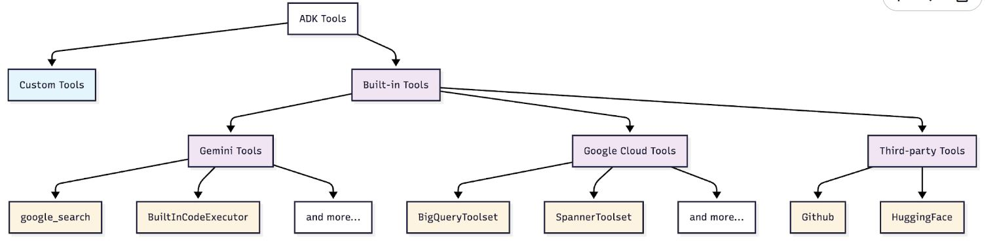

# Google 5 Days AI Agents Intensive Course

https://www.kaggle.com/code/kaggle5daysofai/day-2a-agent-tools

## Day1 介绍ADK基本调用

主要介绍api调用方法，尝试使用google search的tool来解决大模型的实时性问题。

## Day2 介绍agent tools

Tool定义：

- python 函数

  - 字典返回值：{“status”: “success”, “data”: ...} or {“status”: “error”, “error_message”:...}
  - 清晰的指令：llm使用清晰的指令去理解应该调用什么tools
  - 暗示指令：让adk生成合适的目标格式（str、dict、etc）
  - 错误处理：结构化错误响应帮助LLM合适处理错误

  ```python
  def get_fee_for_payment_method(method: str) -> dict:
      fee_database = {
          "platinum credit card": 0.02,  # 2%
          "gold debit card": 0.035,  # 3.5%
          "bank transfer": 0.01,  # 1%
      }
      
      fee = fee_database.get(method.lower())
      if fee is not None:
          return {"status": "success", "fee_percentage": fee}
      else:`
          return {
              "status": "error",
              "error_message": f"Payment method '{method}' not found",
          }
          
  print("✅ Fee lookup function created")
  print(f"💳 Test: {get_fee_for_payment_method('platinum credit card')}")
  
  ```

  ```python
  def get_exchange_rate(base_currency: str, target_currency: str) -> dict:
      """Looks up and returns the exchange rate between two currencies.
  
      Args:
          base_currency: The ISO 4217 currency code of the currency you
                         are converting from (e.g., "USD").
          target_currency: The ISO 4217 currency code of the currency you
                           are converting to (e.g., "EUR").
  
      Returns:
          Dictionary with status and rate information.
          Success: {"status": "success", "rate": 0.93}
          Error: {"status": "error", "error_message": "Unsupported currency pair"}
      """
  
      # Static data simulating a live exchange rate API
      # In production, this would call something like: requests.get("api.exchangerates.com")
      rate_database = {
          "usd": {
              "eur": 0.93,  # Euro
              "jpy": 157.50,  # Japanese Yen
              "inr": 83.58,  # Indian Rupee
          }
      }
  
      # Input validation and processing
      base = base_currency.lower()
      target = target_currency.lower()
  
      # Return structured result with status
      rate = rate_database.get(base, {}).get(target)
      if rate is not None:
          return {"status": "success", "rate": rate}
      else:
          return {
              "status": "error",
              "error_message": f"Unsupported currency pair: {base_currency}/{target_currency}",
          }
  
  
  print("✅ Exchange rate function created")
  print(f"💱 Test: {get_exchange_rate('USD', 'EUR')}")
  ```

  Now let's create our currency agent. Pay attention to how the agent's instructions reference the tools:

  **Key Points:**

  - The `tools=[]` list tells the agent which functions it can use
  - Instructions reference tools by their exact function names (e.g., `get_fee_for_payment_method()`)
  - The agent uses these names to decide when and how to call each tool

  ```python
  # Currency agent with custom function tools
  currency_agent = LlmAgent(
      name="currency_agent",
      model=Gemini(model="gemini-2.5-flash-lite", retry_options=retry_config),
      instruction="""You are a smart currency conversion assistant.
  
      For currency conversion requests:
      1. Use `get_fee_for_payment_method()` to find transaction fees
      2. Use `get_exchange_rate()` to get currency conversion rates
      3. Check the "status" field in each tool's response for errors
      4. Calculate the final amount after fees based on the output from `get_fee_for_payment_method` and `get_exchange_rate` methods and provide a clear breakdown.
      5. First, state the final converted amount.
          Then, explain how you got that result by showing the intermediate amounts. Your explanation must include: the fee percentage and its
          value in the original currency, the amount remaining after the fee, and the exchange rate used for the final conversion.
  
      If any tool returns status "error", explain the issue to the user clearly.
      """,
      tools=[get_fee_for_payment_method, get_exchange_rate],
  )
  
  print("✅ Currency agent created with custom function tools")
  print("🔧 Available tools:")
  print("  • get_fee_for_payment_method - Looks up company fee structure")
  print("  • get_exchange_rate - Gets current exchange rates")
  ```

  LLMs大多不擅长计算，需要调用python code确保结果正确。

  ```python
  calculation_agent = LlmAgent(
      name="CalculationAgent",
      model=Gemini(model="gemini-2.5-flash-lite", retry_options=retry_config),
      instruction="""You are a specialized calculator that ONLY responds with Python code. You are forbidden from providing any text, explanations, or conversational responses.
   
       Your task is to take a request for a calculation and translate it into a single block of Python code that calculates the answer.
       
       **RULES:**
      1.  Your output MUST be ONLY a Python code block.
      2.  Do NOT write any text before or after the code block.
      3.  The Python code MUST calculate the result.
      4.  The Python code MUST print the final result to stdout.
      5.  You are PROHIBITED from performing the calculation yourself. Your only job is to generate the code that will perform the calculation.
     
      Failure to follow these rules will result in an error.
         """,
      code_executor=BuiltInCodeExecutor(),  # Use the built-in Code Executor Tool. This gives the agent code execution capabilities
  )
  ```

  Agent Tools 和 Sub-Agents的区别

  Agent Tools：A调用B作为工具；B的应答返回A；A保持原有对话；

  Sub-Agents：A将控制权完全转移给B；B接收并处理未来的用户输入；A退出循环

### ADK tool 类型

- 自定义工具：为特定需要构建的自定义工具
  - 函数工具：python函数
  - 长期函数工具：特定时间使用的函数操作，如文件操作
  - 代理工具：其他的代理
  - MCP工具：MCP服务中的工具
  - OpenAPI工具：特定API中生成的工具


- 嵌入工具：ADK中已经嵌入的工具
  - Gemini  Tools: 提升Gemini能力的工具，如google_research
  - 谷歌云工具: google 云整合的工具
  - 第三方工具：现有的工具生态体系



### MCP

链接外部系统的社区工具集的开源标准。可以实现：

- 从数据库、apis、服务中访问实时的外部数据
- 通过标准接口使用社区构建的工具
- 通过链接多种特制服务来增强模型能力

MCP如何发挥作用：将自己的代理连接到外部可提供工具的MCP服务。

- MCP服务：提供特定工具，如图片生成、数据库访问
- MCP代理：使用这些工具的自己的agent
- 所有服务工作方式相同：标准交互接口
- 模型架构

____

**1. 挑选MCP服务**

本次demo使用Everything MCP Server——一个为MCP设计的npm库，提供getTinyImage工具，返回简单的测试图像。还可以使用其他的MCP服务，比如谷歌地图、Slcak、DIscord等等。

**2. 创建MCP工具集**

MCP工具集用来整合使用MCP服务的ADK代理。使用npx（Node package runner）运行MCP服务、链接到@modelcontextprotocol/server-everything、仅使用getTInyImage工具。

```python
# MCP integration with Everything Server
mcp_image_server = McpToolset(
    connection_params=StdioConnectionParams(
        server_params=StdioServerParameters(
            command="npx",  # Run MCP server via npx
            args=[
                "-y",  # Argument for npx to auto-confirm install
                "@modelcontextprotocol/server-everything",
            ],
            tool_filter=["getTinyImage"],
        ),
        timeout=30,
    )
)

print("✅ MCP Tool created")
```

背后的逻辑：

1. 服务启动:ADK runs `npx -y @modelcontextprotocol/server-everything`
2. 建立连接:Establishes stdio communication channel
3. 工具检索:Server tells ADK: "I provide getTinyImage" functionality
4. 整合:Tools appear in agent's tool list automatically
5. 运行: When agent calls `getTinyImage()`, ADK forwards to MCP server
6. 应答:Server result is returned to agent seamlessly

**3. 将MCP工具整合到代理中**

## DAY3 代理会话

### a-会话

会话是对话的容器，它以**时间顺序**封装对话历史，并记录单个连续对话中的所有工具交互和响应。会话与**特定用户和智能体**绑定，不与其他用户共享。同样，一个智能体的会话历史也**不与其他智能体共享**。

**会话事件（Session.Events）**

虽然会话是对话的容器，但**事件**才是对话的构建模块。

**事件示例**：

- **用户输入**：来自用户的消息（文本、音频、图像等）
- **智能体响应**：智能体对用户的回复
- **工具调用**：智能体决定使用外部工具或 API
- **工具输出**：从工具调用返回的数据，智能体用它来继续推理

**{} 会话状态（Session.State）**

**session.state** 是智能体的**草稿本**，它存储和更新对话过程中所需的动态细节。您可以将其视为一个全局的**{键, 值}** 对存储，对所有**子智能体和工具**都可用。

------------

session对话并不是永久保存的，当对话遗失的时候，模型会遗忘过去的对话。为弥补这个问题，需要借助数据库。。。

选择正确的sessionservice

| Service                    | Use Case              | Persistence         | Best For             |
| -------------------------- | --------------------- | ------------------- | -------------------- |
| **InMemorySessionService** | Development & Testing | ❌ Lost on restart   | Quick prototypes     |
| **DatabaseSessionService** | Self-managed apps     | ✅ Survives restarts | Small to medium apps |
| **Agent Engine Sessions**  | Production on GCP     | ✅ Fully managed     | Enterprise scale     |

使用sqlite升级databasesessionservice

```python
# Step 1: Create the same agent (notice we use LlmAgent this time)
chatbot_agent = LlmAgent(
    model=Gemini(model="gemini-2.5-flash-lite", retry_options=retry_config),
    name="text_chat_bot",
    description="A text chatbot with persistent memory",
)

# Step 2: Switch to DatabaseSessionService
# SQLite database will be created automatically
db_url = "sqlite:///my_agent_data.db"  # Local SQLite file
session_service = DatabaseSessionService(db_url=db_url)

# Step 3: Create a new runner with persistent storage
runner = Runner(agent=chatbot_agent, app_name=APP_NAME, session_service=session_service)

print("✅ Upgraded to persistent sessions!")
print(f"   - Database: my_agent_data.db")
print(f"   - Sessions will survive restarts!")
```

使用数据库之后，agent可以记录对话，但不同事件之间，对话信息是不共享，相互隔离的

```python
await run_session(
    runner,
    ["What is the capital of India?", "Hello! What is my name?"],
    "test-db-session-01",
)
```


```python
await run_session(
    runner, ["Hello! What is my name?"], "test-db-session-02"
)  # Note, we are using new session name
```


会话数据是如何存储在数据库中的？

```python
import sqlite3

def check_data_in_db():
    with sqlite3.connect("my_agent_data.db") as connection:
        cursor = connection.cursor()
        result = cursor.execute(
            "select app_name, session_id, author, content from events"
        )
        print([_[0] for _ in result.description])
        for each in result.fetchall():
            print(each)


check_data_in_db()
```


之前的对话信息可以快速存储在数据库中，对于复杂的任务，长的上下文可以变得非常大，导致运行速度减慢并且更高的计算开销。我们可以通过自动总结过去的内容，减少上下文的存储复杂度。

会话默认隔离信息共享，但如果使用userid则可以在不同会话之间形成信息交叉。

```python
# Check the state of the new session
session = await session_service.get_session(
    app_name=APP_NAME, user_id=USER_ID, session_id="new-isolated-session"
)

print("New Session State:")
print(session.state)

# Note: Depending on implementation, you might see shared state here.
# This is where the distinction between session-specific and user-specific state becomes important.
```

### b-代理记忆

记忆是一种为代理提供长期知识存储的服务，关键区别在于：

- 会话：短期记忆，单一的对话
- 记忆：长期的知识储备，可在不同对话中交叉使用

会话就像是应用状态，是暂时的；而记忆则像是数据库，是永久的。

为什么需要记忆？记忆提供对话所没有的能力

| Capability                    | What It Means                                      | Example                                                      |
| :---------------------------- | :------------------------------------------------- | :----------------------------------------------------------- |
| **Cross-Conversation Recall** | Access information from any past conversation      | "What preferences has this user mentioned across all chats?" |
| **Intelligent Extraction**    | LLM-powered consolidation extracts key facts       | Stores "allergic to peanuts" instead of 50 raw messages      |
| **Semantic Search**           | Meaning-based retrieval, not just keyword matching | Query "preferred hue" matches "favorite color is blue"       |
| **Persistent Storage**        | Survives application restarts                      | Build knowledge that grows over time                         |

---

**初始化记忆服务**


```python
memory_service = (
    InMemoryMemoryService()
)  # ADK's built-in Memory Service for development and testing
```

添加记忆服务到agent

```python
# Define constants used throughout the notebook
APP_NAME = "MemoryDemoApp"
USER_ID = "demo_user"

# Create agent
user_agent = LlmAgent(
    model=Gemini(model="gemini-2.5-flash-lite", retry_options=retry_config),
    name="MemoryDemoAgent",
    instruction="Answer user questions in simple words.",
)

print("✅ Agent created")
```

创建runner

```python
# Create Session Service
session_service = InMemorySessionService()  # Handles conversations

# Create runner with BOTH services
runner = Runner(
    agent=user_agent,
    app_name="MemoryDemoApp",
    session_service=session_service,
    memory_service=memory_service,  # Memory service is now available!
)

print("✅ Agent and Runner created with memory support!")
```

将memory_service 添加到Runner中使得agent可以使用记忆功能，但并非自动实现，需要显式调用：

1. **Ingest data** using `add_session_to_memory()`
2. **Enable retrieval** by giving your agent memory tools (`load_memory` or `preload_memory`)

使用记忆管理服务，如Vertex AI Memory Bank 可以让对话进行智能提取信息，仅仅InMemoryMemoryService不具有提取功能

```python
# User tells agent about their favorite color
await run_session(
    runner,
    "My favorite color is blue-green. Can you write a Haiku about it?",
    "conversation-01",  # Session ID
)

session = await session_service.get_session(
    app_name=APP_NAME, user_id=USER_ID, session_id="conversation-01"
)

# Let's see what's in the session
print("📝 Session contains:")
for event in session.events:
    text = (
        event.content.parts[0].text[:60]
        if event.content and event.content.parts
        else "(empty)"
    )
    print(f"  {event.content.role}: {text}...")
# 将会话添加到记忆    
# This is the key method!
await memory_service.add_session_to_memory(session)

print("✅ Session added to memory!")
```

**激活agent的记忆检索功能**

agents不能直接访问记忆服务，他们需要使用工具来调用记忆服务。

ADK提供两种内在工具来使用记忆检索：

- load_memory(Reactive)
  - Agent decides when to search memory
  - Only retrieves when the agent thinks it's needed
  - More efficient (saves tokens)
  - Risk: Agent might forget to search
- preload_memory(Proactive)
  - Automatically searches before every turn
  - Memory always available to the agent
  - Guaranteed context, but less efficient
  - Searches even when not needed

```python
# Create agent
user_agent = LlmAgent(
    model=Gemini(model="gemini-2.5-flash-lite", retry_options=retry_config),
    name="MemoryDemoAgent",
    instruction="Answer user questions in simple words. Use load_memory tool if you need to recall past conversations.",
    tools=[
        load_memory
    ],  # Agent now has access to Memory and can search it whenever it decides to!
)

print("✅ Agent with load_memory tool created.")
```

```python
# Create a new runner with the updated agent
runner = Runner(
    agent=user_agent,
    app_name=APP_NAME,
    session_service=session_service,
    memory_service=memory_service,
)

await run_session(runner, "What is my favorite color?", "color-test")
```

