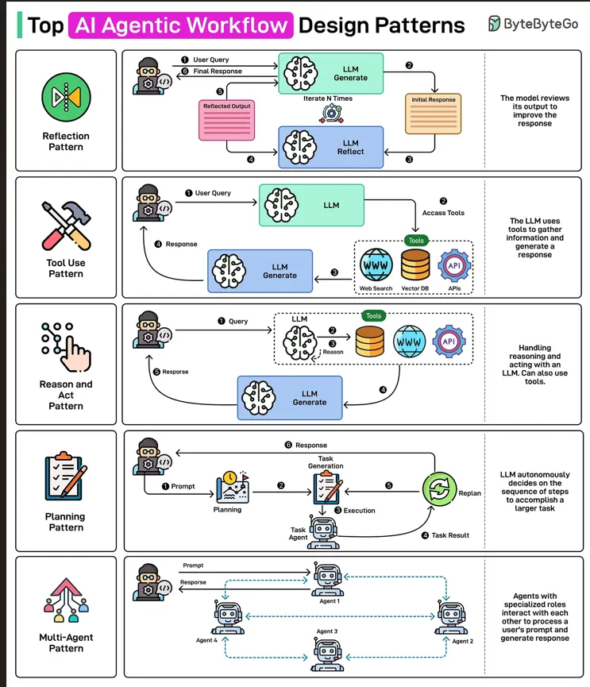

# Agent架构

## Reflection Pattern — The Self-Improving Agent

反思架构模式[**Reflection Pattern** — The Self-Improving Agent](https://medium.com/@Deep-concept/top-ai-agentic-workflow-patterns-that-will-lead-in-2026-0e4755fdc6f6#d893)

## Tool Use Pattern — Extending Agents Beyond Language

工具范式[**Tool Use Pattern** — Extending Agents Beyond Language](https://medium.com/@Deep-concept/top-ai-agentic-workflow-patterns-that-will-lead-in-2026-0e4755fdc6f6#c71b)

## Reason and Act (ReAct) Pattern — Thinking While Doing

推理及反思模式[**Reason and Act (ReAct) Pattern** — Thinking While Doing](https://medium.com/@Deep-concept/top-ai-agentic-workflow-patterns-that-will-lead-in-2026-0e4755fdc6f6#14c1)

## Planning Pattern — Strategic Structure for Complex Tasks

规划模式[**Planning Pattern** — Strategic Structure for Complex Tasks](https://medium.com/@Deep-concept/top-ai-agentic-workflow-patterns-that-will-lead-in-2026-0e4755fdc6f6#035a)

## Multi-Agent Pattern — Collaboration Through Specialization

多agent模式[**Multi-Agent Pattern** — Collaboration Through Specialization](https://medium.com/@Deep-concept/top-ai-agentic-workflow-patterns-that-will-lead-in-2026-0e4755fdc6f6#2a38)
