# Google 5 Days AI Agents Intensive Course

https://www.kaggle.com/code/kaggle5daysofai/day-2a-agent-tools

## Day1 介绍ADK基本调用

主要介绍api调用方法，尝试使用google search的tool来解决大模型的实时性问题。

## Day1b agent架构

多agent 系统

```python
# Research Agent: Its job is to use the google_search tool and present findings.
research_agent = Agent(
    name="ResearchAgent",
    model=Gemini(
        model="gemini-2.5-flash-lite",
        retry_options=retry_config
    ),
    instruction="""You are a specialized research agent. Your only job is to use the
    google_search tool to find 2-3 pieces of relevant information on the given topic and present the findings with citations.""",
    tools=[google_search],
    output_key="research_findings",  # The result of this agent will be stored in the session state with this key.
)

print("✅ research_agent created.")
```

```python
# Summarizer Agent: Its job is to summarize the text it receives.
summarizer_agent = Agent(
    name="SummarizerAgent",
    model=Gemini(
        model="gemini-2.5-flash-lite",
        retry_options=retry_config
    ),
    # The instruction is modified to request a bulleted list for a clear output format.
    instruction="""Read the provided research findings: {research_findings}
Create a concise summary as a bulleted list with 3-5 key points.""",
    output_key="final_summary",
)

print("✅ summarizer_agent created.")
```

根agent

```python
# Root Coordinator: Orchestrates the workflow by calling the sub-agents as tools.
root_agent = Agent(
    name="ResearchCoordinator",
    model=Gemini(
        model="gemini-2.5-flash-lite",
        retry_options=retry_config
    ),
    # This instruction tells the root agent HOW to use its tools (which are the other agents).
    instruction="""You are a research coordinator. Your goal is to answer the user's query by orchestrating a workflow.
1. First, you MUST call the `ResearchAgent` tool to find relevant information on the topic provided by the user.
2. Next, after receiving the research findings, you MUST call the `SummarizerAgent` tool to create a concise summary.
3. Finally, present the final summary clearly to the user as your response.""",
    # We wrap the sub-agents in `AgentTool` to make them callable tools for the root agent.
    tools=[AgentTool(research_agent), AgentTool(summarizer_agent)],
)

print("✅ root_agent created.")
```

### 串行工作流

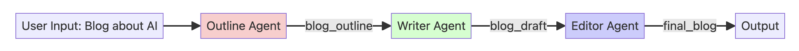

```python
# Outline Agent: Creates the initial blog post outline.
outline_agent = Agent(
    name="OutlineAgent",
    model=Gemini(
        model="gemini-2.5-flash-lite",
        retry_options=retry_config
    ),
    instruction="""Create a blog outline for the given topic with:
    1. A catchy headline
    2. An introduction hook
    3. 3-5 main sections with 2-3 bullet points for each
    4. A concluding thought""",
    output_key="blog_outline",  # The result of this agent will be stored in the session state with this key.
)

print("✅ outline_agent created.")
```

```py
# Writer Agent: Writes the full blog post based on the outline from the previous agent.
writer_agent = Agent(
    name="WriterAgent",
    model=Gemini(
        model="gemini-2.5-flash-lite",
        retry_options=retry_config
    ),
    # The `{blog_outline}` placeholder automatically injects the state value from the previous agent's output.
    instruction="""Following this outline strictly: {blog_outline}
    Write a brief, 200 to 300-word blog post with an engaging and informative tone.""",
    output_key="blog_draft",  # The result of this agent will be stored with this key.
)

print("✅ writer_agent created.")
```

```py
# Editor Agent: Edits and polishes the draft from the writer agent.
editor_agent = Agent(
    name="EditorAgent",
    model=Gemini(
        model="gemini-2.5-flash-lite",
        retry_options=retry_config
    ),
    # This agent receives the `{blog_draft}` from the writer agent's output.
    instruction="""Edit this draft: {blog_draft}
    Your task is to polish the text by fixing any grammatical errors, improving the flow and sentence structure, and enhancing overall clarity.""",
    output_key="final_blog",  # This is the final output of the entire pipeline.
)

print("✅ editor_agent created.")
```

```py
root_agent = SequentialAgent(
    name="BlogPipeline",
    sub_agents=[outline_agent, writer_agent, editor_agent],
)

print("✅ Sequential Agent created.")
```

```py
runner = InMemoryRunner(agent=root_agent)
response = await runner.run_debug(
    "Write a blog post about the benefits of multi-agent systems for software developers"
)
```


### 并行工作流

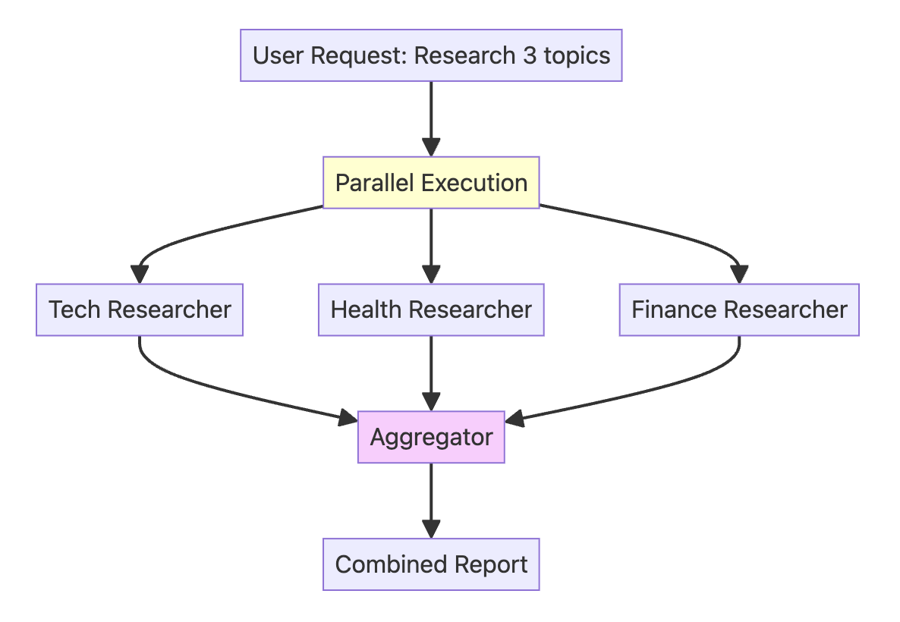

```python
# Tech Researcher: Focuses on AI and ML trends.
tech_researcher = Agent(
    name="TechResearcher",
    model=Gemini(
        model="gemini-2.5-flash-lite",
        retry_options=retry_config
    ),
    instruction="""Research the latest AI/ML trends. Include 3 key developments,
the main companies involved, and the potential impact. Keep the report very concise (100 words).""",
    tools=[google_search],
    output_key="tech_research",  # The result of this agent will be stored in the session state with this key.
)

print("✅ tech_researcher created.")
```

```py
# Health Researcher: Focuses on medical breakthroughs.
health_researcher = Agent(
    name="HealthResearcher",
    model=Gemini(
        model="gemini-2.5-flash-lite",
        retry_options=retry_config
    ),
    instruction="""Research recent medical breakthroughs. Include 3 significant advances,
their practical applications, and estimated timelines. Keep the report concise (100 words).""",
    tools=[google_search],
    output_key="health_research",  # The result will be stored with this key.
)

print("✅ health_researcher created.")
```

```python
# Finance Researcher: Focuses on fintech trends.
finance_researcher = Agent(
    name="FinanceResearcher",
    model=Gemini(
        model="gemini-2.5-flash-lite",
        retry_options=retry_config
    ),
    instruction="""Research current fintech trends. Include 3 key trends,
their market implications, and the future outlook. Keep the report concise (100 words).""",
    tools=[google_search],
    output_key="finance_research",  # The result will be stored with this key.
)

print("✅ finance_researcher created.")
```

```python
# The AggregatorAgent runs *after* the parallel step to synthesize the results.
aggregator_agent = Agent(
    name="AggregatorAgent",
    model=Gemini(
        model="gemini-2.5-flash-lite",
        retry_options=retry_config
    ),
    # It uses placeholders to inject the outputs from the parallel agents, which are now in the session state.
    instruction="""Combine these three research findings into a single executive summary:

    **Technology Trends:**
    {tech_research}
    
    **Health Breakthroughs:**
    {health_research}
    
    **Finance Innovations:**
    {finance_research}
    
    Your summary should highlight common themes, surprising connections, and the most important key takeaways from all three reports. The final summary should be around 200 words.""",
    output_key="executive_summary",  # This will be the final output of the entire system.
)

print("✅ aggregator_agent created.")
```

### 循环工作流

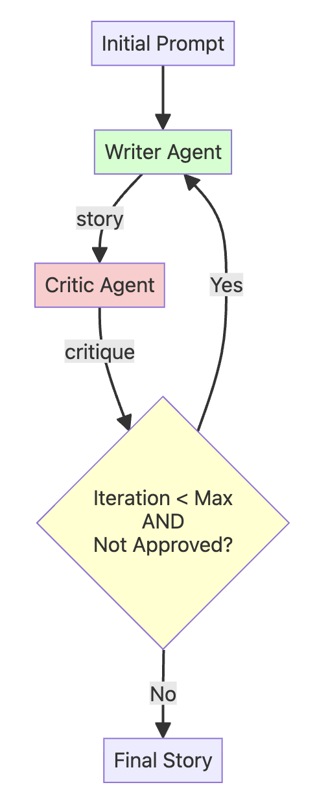

1. **Writer Agent** - Writes a draft of a short story
2. **Critic Agent** - Reviews and critiques the short story to suggest improvements

```python
# This agent runs ONCE at the beginning to create the first draft.
initial_writer_agent = Agent(
    name="InitialWriterAgent",
    model=Gemini(
        model="gemini-2.5-flash-lite",
        retry_options=retry_config
    ),
    instruction="""Based on the user's prompt, write the first draft of a short story (around 100-150 words).
    Output only the story text, with no introduction or explanation.""",
    output_key="current_story",  # Stores the first draft in the state.
)

print("✅ initial_writer_agent created.")
```

```python
# This agent's only job is to provide feedback or the approval signal. It has no tools.
critic_agent = Agent(
    name="CriticAgent",
    model=Gemini(
        model="gemini-2.5-flash-lite",
        retry_options=retry_config
    ),
    instruction="""You are a constructive story critic. Review the story provided below.
    Story: {current_story}
    
    Evaluate the story's plot, characters, and pacing.
    - If the story is well-written and complete, you MUST respond with the exact phrase: "APPROVED"
    - Otherwise, provide 2-3 specific, actionable suggestions for improvement.""",
    output_key="critique",  # Stores the feedback in the state.
)

print("✅ critic_agent created.")
```

```python
# This is the function that the RefinerAgent will call to exit the loop.
def exit_loop():
    """Call this function ONLY when the critique is 'APPROVED', indicating the story is finished and no more changes are needed."""
    return {"status": "approved", "message": "Story approved. Exiting refinement loop."}


print("✅ exit_loop function created.")
```

```python
# This agent refines the story based on critique OR calls the exit_loop function.
refiner_agent = Agent(
    name="RefinerAgent",
    model=Gemini(
        model="gemini-2.5-flash-lite",
        retry_options=retry_config
    ),
    instruction="""You are a story refiner. You have a story draft and critique.
    
    Story Draft: {current_story}
    Critique: {critique}
    
    Your task is to analyze the critique.
    - IF the critique is EXACTLY "APPROVED", you MUST call the `exit_loop` function and nothing else.
    - OTHERWISE, rewrite the story draft to fully incorporate the feedback from the critique.""",
    output_key="current_story",  # It overwrites the story with the new, refined version.
    tools=[
        FunctionTool(exit_loop)
    ],  # The tool is now correctly initialized with the function reference.
)

print("✅ refiner_agent created.")
```

```python
# The LoopAgent contains the agents that will run repeatedly: Critic -> Refiner.
story_refinement_loop = LoopAgent(
    name="StoryRefinementLoop",
    sub_agents=[critic_agent, refiner_agent],
    max_iterations=2,  # Prevents infinite loops
)

# The root agent is a SequentialAgent that defines the overall workflow: Initial Write -> Refinement Loop.
root_agent = SequentialAgent(
    name="StoryPipeline",
    sub_agents=[initial_writer_agent, story_refinement_loop],
)

print("✅ Loop and Sequential Agents created.")
```

```python
runner = InMemoryRunner(agent=root_agent)
response = await runner.run_debug(
    "Write a short story about a lighthouse keeper who discovers a mysterious, glowing map"
)
```


## Day2 介绍agent tools

Tool定义：

- python 函数

  - 字典返回值：{“status”: “success”, “data”: ...} or {“status”: “error”, “error_message”:...}
  - 清晰的指令：llm使用清晰的指令去理解应该调用什么tools
  - 暗示指令：让adk生成合适的目标格式（str、dict、etc）
  - 错误处理：结构化错误响应帮助LLM合适处理错误

  ```python
  def get_fee_for_payment_method(method: str) -> dict:
      fee_database = {
          "platinum credit card": 0.02,  # 2%
          "gold debit card": 0.035,  # 3.5%
          "bank transfer": 0.01,  # 1%
      }
      
      fee = fee_database.get(method.lower())
      if fee is not None:
          return {"status": "success", "fee_percentage": fee}
      else:`
          return {
              "status": "error",
              "error_message": f"Payment method '{method}' not found",
          }
          
  print("✅ Fee lookup function created")
  print(f"💳 Test: {get_fee_for_payment_method('platinum credit card')}")
  
  ```

  ```python
  def get_exchange_rate(base_currency: str, target_currency: str) -> dict:
      """Looks up and returns the exchange rate between two currencies.
  
      Args:
          base_currency: The ISO 4217 currency code of the currency you
                         are converting from (e.g., "USD").
          target_currency: The ISO 4217 currency code of the currency you
                           are converting to (e.g., "EUR").
  
      Returns:
          Dictionary with status and rate information.
          Success: {"status": "success", "rate": 0.93}
          Error: {"status": "error", "error_message": "Unsupported currency pair"}
      """
  
      # Static data simulating a live exchange rate API
      # In production, this would call something like: requests.get("api.exchangerates.com")
      rate_database = {
          "usd": {
              "eur": 0.93,  # Euro
              "jpy": 157.50,  # Japanese Yen
              "inr": 83.58,  # Indian Rupee
          }
      }
  
      # Input validation and processing
      base = base_currency.lower()
      target = target_currency.lower()
  
      # Return structured result with status
      rate = rate_database.get(base, {}).get(target)
      if rate is not None:
          return {"status": "success", "rate": rate}
      else:
          return {
              "status": "error",
              "error_message": f"Unsupported currency pair: {base_currency}/{target_currency}",
          }
  
  
  print("✅ Exchange rate function created")
  print(f"💱 Test: {get_exchange_rate('USD', 'EUR')}")
  ```

  Now let's create our currency agent. Pay attention to how the agent's instructions reference the tools:

  **Key Points:**

  - The `tools=[]` list tells the agent which functions it can use
  - Instructions reference tools by their exact function names (e.g., `get_fee_for_payment_method()`)
  - The agent uses these names to decide when and how to call each tool

  ```python
  # Currency agent with custom function tools
  currency_agent = LlmAgent(
      name="currency_agent",
      model=Gemini(model="gemini-2.5-flash-lite", retry_options=retry_config),
      instruction="""You are a smart currency conversion assistant.
  
      For currency conversion requests:
      1. Use `get_fee_for_payment_method()` to find transaction fees
      2. Use `get_exchange_rate()` to get currency conversion rates
      3. Check the "status" field in each tool's response for errors
      4. Calculate the final amount after fees based on the output from `get_fee_for_payment_method` and `get_exchange_rate` methods and provide a clear breakdown.
      5. First, state the final converted amount.
          Then, explain how you got that result by showing the intermediate amounts. Your explanation must include: the fee percentage and its
          value in the original currency, the amount remaining after the fee, and the exchange rate used for the final conversion.
  
      If any tool returns status "error", explain the issue to the user clearly.
      """,
      tools=[get_fee_for_payment_method, get_exchange_rate],
  )
  
  print("✅ Currency agent created with custom function tools")
  print("🔧 Available tools:")
  print("  • get_fee_for_payment_method - Looks up company fee structure")
  print("  • get_exchange_rate - Gets current exchange rates")
  ```

  LLMs大多不擅长计算，需要调用python code确保结果正确。

  ```python
  calculation_agent = LlmAgent(
      name="CalculationAgent",
      model=Gemini(model="gemini-2.5-flash-lite", retry_options=retry_config),
      instruction="""You are a specialized calculator that ONLY responds with Python code. You are forbidden from providing any text, explanations, or conversational responses.
   
       Your task is to take a request for a calculation and translate it into a single block of Python code that calculates the answer.
       
       **RULES:**
      1.  Your output MUST be ONLY a Python code block.
      2.  Do NOT write any text before or after the code block.
      3.  The Python code MUST calculate the result.
      4.  The Python code MUST print the final result to stdout.
      5.  You are PROHIBITED from performing the calculation yourself. Your only job is to generate the code that will perform the calculation.
     
      Failure to follow these rules will result in an error.
         """,
      code_executor=BuiltInCodeExecutor(),  # Use the built-in Code Executor Tool. This gives the agent code execution capabilities
  )
  ```

  Agent Tools 和 Sub-Agents的区别

  Agent Tools：A调用B作为工具；B的应答返回A；A保持原有对话；

  Sub-Agents：A将控制权完全转移给B；B接收并处理未来的用户输入；A退出循环

### ADK tool 类型

- 自定义工具：为特定需要构建的自定义工具
  - 函数工具：python函数
  - 长期函数工具：特定时间使用的函数操作，如文件操作
  - 代理工具：其他的代理
  - MCP工具：MCP服务中的工具
  - OpenAPI工具：特定API中生成的工具


- 嵌入工具：ADK中已经嵌入的工具
  - Gemini  Tools: 提升Gemini能力的工具，如google_research
  - 谷歌云工具: google 云整合的工具
  - 第三方工具：现有的工具生态体系

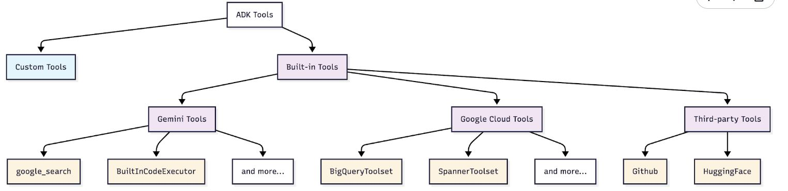

### MCP

链接外部系统的社区工具集的开源标准。可以实现：

- 从数据库、apis、服务中访问实时的外部数据
- 通过标准接口使用社区构建的工具
- 通过链接多种特制服务来增强模型能力

MCP如何发挥作用：将自己的代理连接到外部可提供工具的MCP服务。

- MCP服务：提供特定工具，如图片生成、数据库访问
- MCP代理：使用这些工具的自己的agent
- 所有服务工作方式相同：标准交互接口
- 模型架构

____

**1. 挑选MCP服务**

本次demo使用Everything MCP Server——一个为MCP设计的npm库，提供getTinyImage工具，返回简单的测试图像。还可以使用其他的MCP服务，比如谷歌地图、Slcak、DIscord等等。

**2. 创建MCP工具集**

MCP工具集用来整合使用MCP服务的ADK代理。使用npx（Node package runner）运行MCP服务、链接到@modelcontextprotocol/server-everything、仅使用getTInyImage工具。

```python
# MCP integration with Everything Server
mcp_image_server = McpToolset(
    connection_params=StdioConnectionParams(
        server_params=StdioServerParameters(
            command="npx",  # Run MCP server via npx
            args=[
                "-y",  # Argument for npx to auto-confirm install
                "@modelcontextprotocol/server-everything",
            ],
            tool_filter=["getTinyImage"],
        ),
        timeout=30,
    )
)

print("✅ MCP Tool created")
```

背后的逻辑：

1. 服务启动:ADK runs `npx -y @modelcontextprotocol/server-everything`
2. 建立连接:Establishes stdio communication channel
3. 工具检索:Server tells ADK: "I provide getTinyImage" functionality
4. 整合:Tools appear in agent's tool list automatically
5. 运行: When agent calls `getTinyImage()`, ADK forwards to MCP server
6. 应答:Server result is returned to agent seamlessly

**3. 将MCP工具整合到代理中**

## DAY3 a-会话

会话是对话的容器，它以**时间顺序**封装对话历史，并记录单个连续对话中的所有工具交互和响应。会话与**特定用户和智能体**绑定，不与其他用户共享。同样，一个智能体的会话历史也**不与其他智能体共享**。

**会话事件（Session.Events）**

虽然会话是对话的容器，但**事件**才是对话的构建模块。

**事件示例**：

- **用户输入**：来自用户的消息（文本、音频、图像等）
- **智能体响应**：智能体对用户的回复
- **工具调用**：智能体决定使用外部工具或 API
- **工具输出**：从工具调用返回的数据，智能体用它来继续推理

**{} 会话状态（Session.State）**

**session.state** 是智能体的**草稿本**，它存储和更新对话过程中所需的动态细节。您可以将其视为一个全局的**{键, 值}** 对存储，对所有**子智能体和工具**都可用。

------------

session对话并不是永久保存的，当对话遗失的时候，模型会遗忘过去的对话。为弥补这个问题，需要借助数据库。。。

选择正确的sessionservice

| Service                    | Use Case              | Persistence         | Best For             |
| -------------------------- | --------------------- | ------------------- | -------------------- |
| **InMemorySessionService** | Development & Testing | ❌ Lost on restart   | Quick prototypes     |
| **DatabaseSessionService** | Self-managed apps     | ✅ Survives restarts | Small to medium apps |
| **Agent Engine Sessions**  | Production on GCP     | ✅ Fully managed     | Enterprise scale     |

使用sqlite升级databasesessionservice

```python
# Step 1: Create the same agent (notice we use LlmAgent this time)
chatbot_agent = LlmAgent(
    model=Gemini(model="gemini-2.5-flash-lite", retry_options=retry_config),
    name="text_chat_bot",
    description="A text chatbot with persistent memory",
)

# Step 2: Switch to DatabaseSessionService
# SQLite database will be created automatically
db_url = "sqlite:///my_agent_data.db"  # Local SQLite file
session_service = DatabaseSessionService(db_url=db_url)

# Step 3: Create a new runner with persistent storage
runner = Runner(agent=chatbot_agent, app_name=APP_NAME, session_service=session_service)

print("✅ Upgraded to persistent sessions!")
print(f"   - Database: my_agent_data.db")
print(f"   - Sessions will survive restarts!")
```

使用数据库之后，agent可以记录对话，但不同事件之间，对话信息是不共享，相互隔离的

```python
await run_session(
    runner,
    ["What is the capital of India?", "Hello! What is my name?"],
    "test-db-session-01",
)
```


```python
await run_session(
    runner, ["Hello! What is my name?"], "test-db-session-02"
)  # Note, we are using new session name
```


会话数据是如何存储在数据库中的？

```python
import sqlite3

def check_data_in_db():
    with sqlite3.connect("my_agent_data.db") as connection:
        cursor = connection.cursor()
        result = cursor.execute(
            "select app_name, session_id, author, content from events"
        )
        print([_[0] for _ in result.description])
        for each in result.fetchall():
            print(each)


check_data_in_db()
```


之前的对话信息可以快速存储在数据库中，对于复杂的任务，长的上下文可以变得非常大，导致运行速度减慢并且更高的计算开销。我们可以通过自动总结过去的内容，减少上下文的存储复杂度。

会话默认隔离信息共享，但如果使用userid则可以在不同会话之间形成信息交叉。

```python
# Check the state of the new session
session = await session_service.get_session(
    app_name=APP_NAME, user_id=USER_ID, session_id="new-isolated-session"
)

print("New Session State:")
print(session.state)

# Note: Depending on implementation, you might see shared state here.
# This is where the distinction between session-specific and user-specific state becomes important.
```

## Day3b-代理记忆

记忆是一种为代理提供长期知识存储的服务，关键区别在于：

- 会话：短期记忆，单一的对话
- 记忆：长期的知识储备，可在不同对话中交叉使用

会话就像是应用状态，是暂时的；而记忆则像是数据库，是永久的。

为什么需要记忆？记忆提供对话所没有的能力

| Capability                    | What It Means                                      | Example                                                      |
| :---------------------------- | :------------------------------------------------- | :----------------------------------------------------------- |
| **Cross-Conversation Recall** | Access information from any past conversation      | "What preferences has this user mentioned across all chats?" |
| **Intelligent Extraction**    | LLM-powered consolidation extracts key facts       | Stores "allergic to peanuts" instead of 50 raw messages      |
| **Semantic Search**           | Meaning-based retrieval, not just keyword matching | Query "preferred hue" matches "favorite color is blue"       |
| **Persistent Storage**        | Survives application restarts                      | Build knowledge that grows over time                         |

---

**初始化记忆服务**


```python
memory_service = (
    InMemoryMemoryService()
)  # ADK's built-in Memory Service for development and testing
```

添加记忆服务到agent

```python
# Define constants used throughout the notebook
APP_NAME = "MemoryDemoApp"
USER_ID = "demo_user"

# Create agent
user_agent = LlmAgent(
    model=Gemini(model="gemini-2.5-flash-lite", retry_options=retry_config),
    name="MemoryDemoAgent",
    instruction="Answer user questions in simple words.",
)

print("✅ Agent created")
```

创建runner

```python
# Create Session Service
session_service = InMemorySessionService()  # Handles conversations

# Create runner with BOTH services
runner = Runner(
    agent=user_agent,
    app_name="MemoryDemoApp",
    session_service=session_service,
    memory_service=memory_service,  # Memory service is now available!
)

print("✅ Agent and Runner created with memory support!")
```

将memory_service 添加到Runner中使得agent可以使用记忆功能，但并非自动实现，需要显式调用：

1. **Ingest data** using `add_session_to_memory()`
2. **Enable retrieval** by giving your agent memory tools (`load_memory` or `preload_memory`)

使用记忆管理服务，如Vertex AI Memory Bank 可以让对话进行智能提取信息，仅仅InMemoryMemoryService不具有提取功能

```python
# User tells agent about their favorite color
await run_session(
    runner,
    "My favorite color is blue-green. Can you write a Haiku about it?",
    "conversation-01",  # Session ID
)

session = await session_service.get_session(
    app_name=APP_NAME, user_id=USER_ID, session_id="conversation-01"
)

# Let's see what's in the session
print("📝 Session contains:")
for event in session.events:
    text = (
        event.content.parts[0].text[:60]
        if event.content and event.content.parts
        else "(empty)"
    )
    print(f"  {event.content.role}: {text}...")
# 将会话添加到记忆    
# This is the key method!
await memory_service.add_session_to_memory(session)

print("✅ Session added to memory!")
```

### **激活agent的记忆检索功能**

agents不能直接访问记忆服务，他们需要使用工具来调用记忆服务。

ADK提供两种内在工具来使用记忆检索：

- load_memory(Reactive)
  - Agent decides when to search memory
  - Only retrieves when the agent thinks it's needed
  - More efficient (saves tokens)
  - Risk: Agent might forget to search
- preload_memory(Proactive)
  - Automatically searches before every turn
  - Memory always available to the agent
  - Guaranteed context, but less efficient
  - Searches even when not needed

```python
# Create agent
user_agent = LlmAgent(
    model=Gemini(model="gemini-2.5-flash-lite", retry_options=retry_config),
    name="MemoryDemoAgent",
    instruction="Answer user questions in simple words. Use load_memory tool if you need to recall past conversations.",
    tools=[
        load_memory
    ],  # Agent now has access to Memory and can search it whenever it decides to!
)

print("✅ Agent with load_memory tool created.")
```

```python
# Create a new runner with the updated agent
runner = Runner(
    agent=user_agent,
    app_name=APP_NAME,
    session_service=session_service,
    memory_service=memory_service,
)

await run_session(runner, "What is my favorite color?", "color-test")
```

sk-xVIOEZ266vo9ObNUOqRdBBfSgSYaVduCUoh2aZm3sbckXAVD

**自助记忆检索功能**

记忆检索功能可以直接在代码中实现，主要用于：

- debugging上下文记忆
- 简历分析面板
- 创建自定义的记忆管理UIs

`search_memory()`方法输入一个文本请求，返回一个记忆搜寻的应答

```python
# Search for color preferences
search_response = await memory_service.search_memory(
    app_name=APP_NAME, user_id=USER_ID, query="joke"
)

print("🔍 Search Results:")
print(f"  Found {len(search_response.memories)} relevant memories")
print()

for memory in search_response.memories:
    if memory.content and memory.content.parts:
        text = memory.content.parts[0].text[:80]
        print(f"  [{memory.author}]: {text}...")
```

**记忆检索是如何起作用的**

**InMemoryMemoryService(本notebook中):**

- **方法**：关键词匹配
- **示例**："favorite color"（最喜欢的颜色）能够匹配，因为存在这些确切的单词
- **局限性**："preferred hue"（偏爱的色调）将无法匹配

**VertexAiMemoryBankService（第5天将介绍的）：**

- **方法**：通过嵌入向量进行语义搜索
- **示例**："preferred hue"（偏爱的色调）**能够**匹配"favorite color"（最喜欢的颜色）
- **优势**：理解语义含义，而不仅仅是关键词匹配

### 自动记忆存储

目前我们使用了`add_session_to_memory()`将数据转化为长期记忆。生产系统需要将这个行为自动化。

#### 回调

**想象回调功能在代理的生命周期中是事件监听器。**当一个代理抛出一个请求，它会经历不同的阶段：接受输入，调用llm，调用工具，生成回应。召回可以在每个阶段自定义逻辑而不需要修改代理的核心代码

可用的回调类型：

- **before_agent_callback** → 在代理开始处理请求**之前**运行
- **after_agent_callback** → 在代理完成本次执行**之后**运行
- **before_tool_callback** / **after_tool_callback** → 围绕工具调用（调用前/后）
- **before_model_callback** / **after_model_callback** → 围绕 LLM 调用（调用前/后）
- **on_model_error_callback** → 当发生错误时运行

常见使用场景：

- **日志记录与可观测性**（追踪代理行为）
- **自动数据持久化**（如保存到记忆系统）
- **自定义验证或过滤**
- **性能监控**

**自动记忆存储的回调**

```python
async def auto_save_to_memory(callback_context):
    """Automatically save session to memory after each agent turn."""
    await callback_context._invocation_context.memory_service.add_session_to_memory(
        callback_context._invocation_context.session
    )


print("✅ Callback created.")
```

```python
# Agent with automatic memory saving
auto_memory_agent = LlmAgent(
    model=Gemini(model="gemini-2.5-flash-lite", retry_options=retry_config),
    name="AutoMemoryAgent",
    instruction="Answer user questions.",
    tools=[preload_memory],
    after_agent_callback=auto_save_to_memory,  # Saves after each turn!
)

print("✅ Agent created with automatic memory saving!")
```

```python
# Create a runner for the auto-save agent
# This connects our automated agent to the session and memory services
auto_runner = Runner(
    agent=auto_memory_agent,  # Use the agent with callback + preload_memory
    app_name=APP_NAME,
    session_service=session_service,  # Same services from Section 3
    memory_service=memory_service,
)

print("✅ Runner created.")
```

```python
# Test 1: Tell the agent about a gift (first conversation)
# The callback will automatically save this to memory when the turn completes
await run_session(
    auto_runner,
    "I gifted a new toy to my nephew on his 1st birthday!",
    "auto-save-test",
)

# Test 2: Ask about the gift in a NEW session (second conversation)
# The agent should retrieve the memory using preload_memory and answer correctly
await run_session(
    auto_runner,
    "What did I gift my nephew?",
    "auto-save-test-2",  # Different session ID - proves memory works across sessions!
)
```

何时存储？

| Timing                  | Implementation                | Best For                           |
| ----------------------- | ----------------------------- | ---------------------------------- |
| **After every turn**    | `after_agent_callback`        | Real-time memory updates           |
| **End of conversation** | Manual call when session ends | Batch processing, reduce API calls |
| **Periodic intervals**  | Timer-based background job    | Long-running conversations         |

### 记忆整合

原始存储的局限性

我们目前存储的内容：

- 每条用户消息
- 每条代理响应
- 每个工具调用

存在的问题：

```
会话：50条消息 = 10,000个token
记忆：存储所有50条消息
搜索：返回全部50条消息 → 代理必须处理10,000个token
```

这种方案不可扩展。我们需要**记忆整合**。

#### 什么是记忆整合

抛弃对话噪音，只提取最重要的因素

**efore (Raw Storage):**

```
User: "My favorite color is BlueGreen. I also like purple. 
       Actually, I prefer BlueGreen most of the time."
Agent: "Great! I'll remember that."
User: "Thanks!"
Agent: "You're welcome!"

→ Stores ALL 4 messages (redundant, verbose)
```

**After (Consolidation):**

```
Extracted Memory: "User's favorite color: BlueGreen"

→ Stores 1 concise fact
```

**Benefits:** Less storage, faster retrieval, more accurate answers.

#### 记忆整合如何生效

**The pipeline:**

```
1. Raw Session Events
   ↓
2. LLM analyzes conversation
   ↓
3. Extracts key facts
   ↓
4. Stores concise memories
   ↓
5. Merges with existing memories (deduplication)
```

**Example transformation:**

```
Input:  "I'm allergic to peanuts. I can't eat anything with nuts."

Output: Memory {
  allergy: "peanuts, tree nuts"
  severity: "avoid completely"
}
```

Natural language → Structured, actionable data.结构化、可操作的数据

#### 记忆整合的进阶

**关键要点：托管记忆服务会自动处理记忆整合。**

**你使用相同的API：**

```
add_session_to_memory() ← 相同的方法
search_memory() ← 相同的方法
```

**区别在于后台处理方式：**

- **InMemoryMemoryService**：存储原始事件
- **VertexAiMemoryBankService**：存储前智能整合记忆

**📚 了解更多：**

- Vertex AI Memory Bank：记忆整合指南 → 你将在第5天探索这个功能！

## Day4a Agent observability

- 学习如何给agent添加观察能力
- 学习如何评估agent的工作状况

什么是agent观察能力？与其他的软件不同，ai agent会出一些奇怪的问题。比如：

```
User: "Find quantum computing papers"
Agent: "I cannot help with that request."
You: 😭 WHY?? Is it the prompt? Missing tools? API error?
```

agent观察能力可以让你的agent决策可视化，你可以看到发送到llm的指令以及提示词，什么工具是可用的，模型是如何生效的，以及错误发生在哪里。

```
DEBUG Log: LLM Request shows "Functions: []" (no tools!)
You: 🎯 Aha! Missing google_search tool - easy fix!
```

Agent Observability的基础功能

- 日志：日志是单个事件的记录，告知在特定时刻发生了什么。

- 追踪：追踪将日志串联成完整故事，通过揭示全步骤序列展示最终结果的产生原因。

- 指标：指标是汇总性数值（如平均值与错误率），用于反映智能体的整体运行状况。

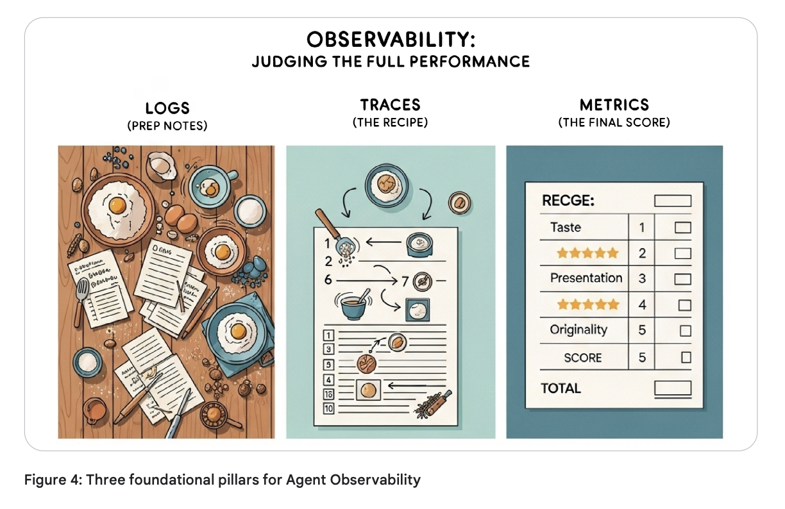

- 使用Trace功能debug
- 使用本地日志debug

```python
import logging
import os

# Clean up any previous logs
for log_file in ["logger.log", "web.log", "tunnel.log"]:
    if os.path.exists(log_file):
        os.remove(log_file)
        print(f"🧹 Cleaned up {log_file}")

# Configure logging with DEBUG log level.
logging.basicConfig(
    filename="logger.log",
    level=logging.DEBUG,
    format="%(filename)s:%(lineno)s %(levelname)s:%(message)s",
)

print("✅ Logging configured")
```

### 在产品中记录

- 问题1：产品部署。如何在已部署的产品上debug？
- 问题2：自动化系统。在现有管线上，agent一天跑1000次。如何自动化测试各部分的耗时？而不是对每个环节debug，共debug1000次

解决办法：需要捕获数据信息——在代码中添加日志。在传统软件开发中，只需要在代码中打log，但是在agent中，这是不同的。通常的做法是在agent中加入插件。

---

如何在产品中添加日志功能

**插件**是一个自定义代码模块，会在智能体生命周期的不同阶段自动运行。插件由"回调函数"构成，这些回调提供了拦截智能体流程的钩子。可以这样理解：

- 您的智能体工作流程：用户消息 → 智能体思考 → 调用工具 → 返回响应

- 插件可介入此流程：在智能体启动前 → 工具运行后 → LLM响应时 → 等各个阶段

- 插件包含您的自定义代码：日志记录、运行监控、安全检查、缓存处理等。

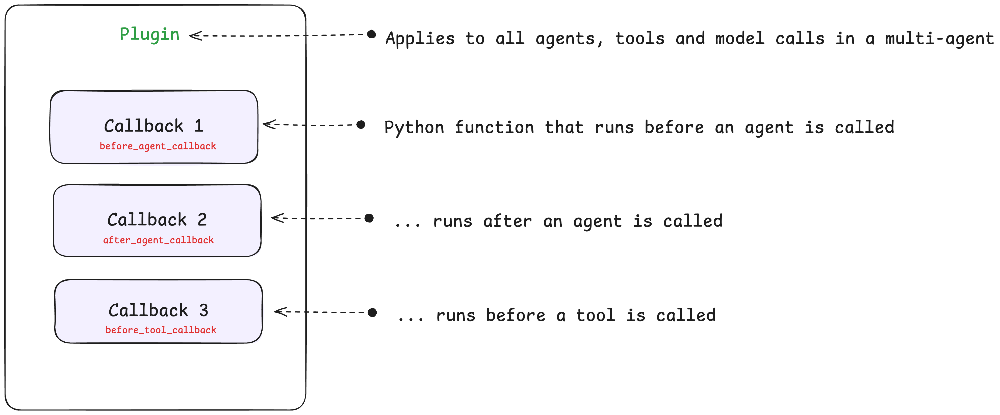

**回调函数**

回调函数是插件内部的基本组成单元——它们只是简单的Python函数，在智能体生命周期的特定时间点执行！多个回调函数组合在一起就构成了一个插件。

回调函数主要有以下几种类型：

- **before/after_agent_callbacks** - 在智能体被调用**之前/之后**执行

- **before/after_tool_callbacks**  在工具被调用**之前/之后**执行

- **before/after_model_callbacks** - 类似地，在LLM模型被调用**之前/之后**执行

- **on_model_error_callback** - 在遇到模型错误时执行


### Plugin如何设计

```python
print("----- EXAMPLE PLUGIN - DOES NOTHING ----- ")

import logging
from google.adk.agents.base_agent import BaseAgent
from google.adk.agents.callback_context import CallbackContext
from google.adk.models.llm_request import LlmRequest
from google.adk.plugins.base_plugin import BasePlugin


# Applies to all agent and model calls
class CountInvocationPlugin(BasePlugin):
    """A custom plugin that counts agent and tool invocations."""

    def __init__(self) -> None:
        """Initialize the plugin with counters."""
        super().__init__(name="count_invocation")
        self.agent_count: int = 0
        self.tool_count: int = 0
        self.llm_request_count: int = 0

    # Callback 1: Runs before an agent is called. You can add any custom logic here.
    async def before_agent_callback(
        self, *, agent: BaseAgent, callback_context: CallbackContext
    ) -> None:
        """Count agent runs."""
        self.agent_count += 1
        logging.info(f"[Plugin] Agent run count: {self.agent_count}")

    # Callback 2: Runs before a model is called. You can add any custom logic here.
    async def before_model_callback(
        self, *, callback_context: CallbackContext, llm_request: LlmRequest
    ) -> None:
        """Count LLM requests."""
        self.llm_request_count += 1
        logging.info(f"[Plugin] LLM request count: {self.llm_request_count}")
```

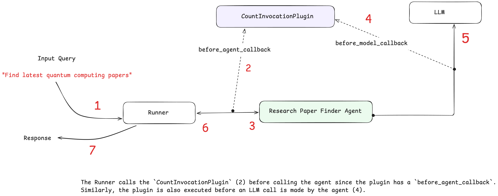

```py
from google.adk.agents import LlmAgent
from google.adk.models.google_llm import Gemini
from google.adk.tools.agent_tool import AgentTool
from google.adk.tools.google_search_tool import google_search

from google.genai import types
from typing import List

retry_config = types.HttpRetryOptions(
    attempts=5,  # Maximum retry attempts
    exp_base=7,  # Delay multiplier
    initial_delay=1,
    http_status_codes=[429, 500, 503, 504],  # Retry on these HTTP errors
)


def count_papers(papers: List[str]):
    """
    This function counts the number of papers in a list of strings.
    Args:
      papers: A list of strings, where each string is a research paper.
    Returns:
      The number of papers in the list.
    """
    return len(papers)


# Google search agent
google_search_agent = LlmAgent(
    name="google_search_agent",
    model=Gemini(model="gemini-2.5-flash-lite", retry_options=retry_config),
    description="Searches for information using Google search",
    instruction="Use the google_search tool to find information on the given topic. Return the raw search results.",
    tools=[google_search],
)

# Root agent
research_agent_with_plugin = LlmAgent(
    name="research_paper_finder_agent",
    model=Gemini(model="gemini-2.5-flash-lite", retry_options=retry_config),
    instruction="""Your task is to find research papers and count them. 
   
   You must follow these steps:
   1) Find research papers on the user provided topic using the 'google_search_agent'. 
   2) Then, pass the papers to 'count_papers' tool to count the number of papers returned.
   3) Return both the list of research papers and the total number of papers.
   """,
    tools=[AgentTool(agent=google_search_agent), count_papers],
)

print("✅ Agent created")
```

**To use `LoggingPlugin` in the above research agent,**

1. Import the plugin
2. Add it when initializing the `InMemoryRunner`.

```py
from google.adk.runners import InMemoryRunner
from google.adk.plugins.logging_plugin import (
    LoggingPlugin,
)  # <---- 1. Import the Plugin
from google.genai import types
import asyncio

runner = InMemoryRunner(
    agent=research_agent_with_plugin,
    plugins=[
        LoggingPlugin()
    ],  # <---- 2. Add the plugin. Handles standard Observability logging across ALL agents
)

print("✅ Runner configured")
```

```py
print("🚀 Running agent with LoggingPlugin...")
print("📊 Watch the comprehensive logging output below:\n")

response = await runner.run_debug("Find recent papers on quantum computing")
```


## Day4b Agent Evaluation

#### Interactive Evaluation with ADK Web UI

#### 系统性评估

回归测试是指重新运行现有的测试，以确保新的更改没有破坏之前正常工作的功能。

ADK提供了两种自动进行回归和批量测试的方法：使用pytest和`adk eval`CLI命令。在本节中，我们将使用CLI命令。有关pytest方法的更多信息，请参阅本笔记本末尾资源部分中的链接。

下图展示了评估的整体流程。从高层次来看，评估分为四个步骤：

1. **创建评估配置** - 定义指标或您想要测量的内容
2. **创建测试用例** - 用于对比的样本测试用例
3. **使用测试查询运行代理**
4. **比较结果**

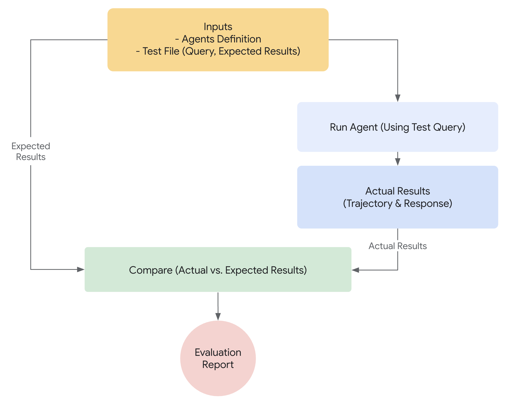

```python
import json

# Create evaluation configuration with basic criteria
eval_config = {
    "criteria": {
        "tool_trajectory_avg_score": 1.0,  # Perfect tool usage required
        "response_match_score": 0.8,  # 80% text similarity threshold
    }
}

with open("home_automation_agent/test_config.json", "w") as f:
    json.dump(eval_config, f, indent=2)

print("✅ Evaluation configuration created!")
print("\n📊 Evaluation Criteria:")
print("• tool_trajectory_avg_score: 1.0 - Requires exact tool usage match")
print("• response_match_score: 0.8 - Requires 80% text similarity")
print("\n🎯 What this evaluation will catch:")
print("✅ Incorrect tool usage (wrong device, location, or status)")
print("✅ Poor response quality and communication")
print("✅ Deviations from expected behavior patterns")
```

```python
# Create evaluation test cases that reveal tool usage and response quality problems
test_cases = {
    "eval_set_id": "home_automation_integration_suite",
    "eval_cases": [
        {
            "eval_id": "living_room_light_on",
            "conversation": [
                {
                    "user_content": {
                        "parts": [
                            {"text": "Please turn on the floor lamp in the living room"}
                        ]
                    },
                    "final_response": {
                        "parts": [
                            {
                                "text": "Successfully set the floor lamp in the living room to on."
                            }
                        ]
                    },
                    "intermediate_data": {
                        "tool_uses": [
                            {
                                "name": "set_device_status",
                                "args": {
                                    "location": "living room",
                                    "device_id": "floor lamp",
                                    "status": "ON",
                                },
                            }
                        ]
                    },
                }
            ],
        },
        {
            "eval_id": "kitchen_on_off_sequence",
            "conversation": [
                {
                    "user_content": {
                        "parts": [{"text": "Switch on the main light in the kitchen."}]
                    },
                    "final_response": {
                        "parts": [
                            {
                                "text": "Successfully set the main light in the kitchen to on."
                            }
                        ]
                    },
                    "intermediate_data": {
                        "tool_uses": [
                            {
                                "name": "set_device_status",
                                "args": {
                                    "location": "kitchen",
                                    "device_id": "main light",
                                    "status": "ON",
                                },
                            }
                        ]
                    },
                }
            ],
        },
    ],
}
```


```python
import json

with open("home_automation_agent/integration.evalset.json", "w") as f:
    json.dump(test_cases, f, indent=2)

print("✅ Evaluation test cases created")
print("\n🧪 Test scenarios:")
for case in test_cases["eval_cases"]:
    user_msg = case["conversation"][0]["user_content"]["parts"][0]["text"]
    print(f"• {case['eval_id']}: {user_msg}")

print("\n📊 Expected results:")
print("• basic_device_control: Should pass both criteria")
print(
    "• wrong_tool_usage_test: May fail tool_trajectory if agent uses wrong parameters"
)
print(
    "• poor_response_quality_test: May fail response_match if response differs too much"
)
```

```python
print("🚀 Run this command to execute evaluation:")
!adk eval home_automation_agent home_automation_agent/integration.evalset.json --config_file_path=home_automation_agent/test_config.json --print_detailed_results
```

## Day5a Agent2Agent Communication 

本文旨在教学如何构建多智能体系统，不同的智能体之间可以通过**A2A Protocol**相互交流。

- 理解A2A protocol以及如何抉择次智能体以及A2A的使用时间
- 学习常见的A2A架构模式 (cross-framework, cross-language, cross-organization)
- **使用 to_a2a() 通过 A2A 公开 ADK 智能体**

- **使用 RemoteA2aAgent 调用远程智能体**

- **构建产品目录集成系统**

---

**复杂智能体面临的问题**：

- 单个智能体无法处理所有任务 - 为不同领域设计的专业智能体表现更佳
- 智能体之间需要协同合作 - 客户服务需要产品数据，订单系统需要库存信息
- 不同团队开发不同的智能体 - 您可能需要集成外部供应商的智能体
- 智能体可能使用不同的语言/框架 - 您需要一个标准的通信协议

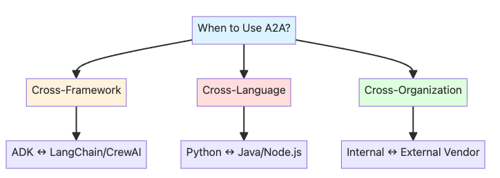

- 跨框架集成：ADK 智能体与其他智能体框架通信
- 跨语言通信：Python 智能体调用 Java 或 Node.js 智能体
- 跨组织边界：您的内部智能体与外部供应商服务集成

我们将构建一个实用的电商集成系统：

1. **产品目录智能体**（通过A2A公开）- 外部供应商服务，提供产品信息
2. **客户支持智能体**（消费者）- 您的内部智能体，通过查询产品数据帮助客户

```
┌──────────────────────┐           ┌──────────────────────┐
│ 客户支持智能体         │  ─A2A──▶  │ 产品目录智能体         │
│ （消费者）            │            │ （供应商）            │
│ 您的公司              │           │ 外部服务              │
│ (localhost:8000)     │           │ (localhost:8001)     │
└──────────────────────┘           └──────────────────────┘
```

**为什么采用A2A：**

- 产品目录由外部供应商维护（您无法修改其代码）
- 不同组织拥有独立的系统
- 服务之间需要正式的契约/协议
- 产品目录可能使用不同的语言/框架

------

**💡 A2A VS 本地子智能体：决策表**

==**A2A服务一般用于不同的组织、服务、框架等等。本地子智能体服务需要较高的一致性及低延迟。**==

| 因素       | 使用 A2A             | 使用本地子智能体 |
| ---------- | -------------------- | ---------------- |
| 智能体位置 | 外部服务，不同代码库 | 同一代码库，内部 |
| 所有权     | 不同团队/组织        | 您的团队         |
| 网络       | 不同机器上的智能体   | 同一进程/机器    |
| 性能       | 网络延迟可接受       | 需要低延迟       |
| 语言/框架  | 需要跨语言/框架      | 相同语言         |
| 契约       | 需要正式API契约      | 内部接口         |
| 示例       | 外部供应商产品目录   | 内部订单处理步骤 |

------

**📝 教程背景**

在本教程中，为学习目的，我们将在本地模拟这两个智能体（都运行在本地主机上）。在实际生产环境中：

- 产品目录智能体会运行在供应商的基础设施上（例如 https://vendor.com）
- 客户支持智能体会运行在您的基础设施上
- 它们将通过互联网使用A2A协议进行通信

这种本地模拟让您无需部署实际服务就能学习A2A！

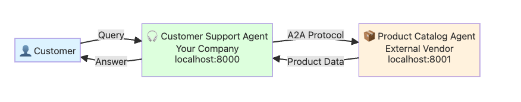

**工作原理：**

1. **客户咨询** → 客户向您的客户支持智能体提出产品相关问题
2. **识别需求** → 支持智能体意识到需要获取产品信息
3. **远程调用** → 支持智能体通过A2A协议调用产品目录智能体
4. **获取数据** → 产品目录智能体（外部供应商）返回产品数据
5. **整合响应** → 支持智能体整合信息并形成最终回答
6. **回复客户** → 支持智能体将回答返回给客户

```py
客户: "华为P70 Pro手机有现货吗？价格多少？"

支持智能体: （分析请求）
    → 识别需要查询产品库存和价格
    → 通过A2A调用产品目录服务
    → 发送请求："查询华为P70 Pro库存状态和价格"

产品目录智能体: （接收请求）
    → 查询数据库
    → 返回：{"产品": "华为P70 Pro", "库存": 15, "价格": 6999, "状态": "在售"}

支持智能体: （整合信息）
    → 组织回答
    → 回复客户："华为P70 Pro目前有15台现货，售价6999元。"

客户: "谢谢，我想订购一台。"
```

**🗺️ 教程步骤**

在本教程中，您将完成以下6个步骤：

1. **创建产品目录智能体** - 构建供应商的产品查询智能体
2. **通过A2A公开** - 使用 `to_a2a()`使其可访问
3. **启动服务器** - 将智能体作为后台服务运行
4. **创建客户支持智能体** - 构建消费者智能体
5. **测试通信** - 通过实际查询查看A2A的运行效果
6. **理解流程** - 了解背后的运行机制

```py
import os
from kaggle_secrets import UserSecretsClient

try:
    GOOGLE_API_KEY = UserSecretsClient().get_secret("GOOGLE_API_KEY")
    os.environ["GOOGLE_API_KEY"] = GOOGLE_API_KEY
    print("✅ Setup and authentication complete.")
except Exception as e:
    print(
        f"🔑 Authentication Error: Please make sure you have added 'GOOGLE_API_KEY' to your Kaggle secrets. Details: {e}"
    )
```

```py
import json
import requests
import subprocess
import time
import uuid

from google.adk.agents import LlmAgent
from google.adk.agents.remote_a2a_agent import (
    RemoteA2aAgent,
    AGENT_CARD_WELL_KNOWN_PATH,
)

from google.adk.a2a.utils.agent_to_a2a import to_a2a
from google.adk.models.google_llm import Gemini
from google.adk.runners import Runner
from google.adk.sessions import InMemorySessionService
from google.genai import types

# Hide additional warnings in the notebook
import warnings

warnings.filterwarnings("ignore")

print("✅ ADK components imported successfully.")
```

```py
retry_config = types.HttpRetryOptions(
    attempts=5,  # Maximum retry attempts
    exp_base=7,  # Delay multiplier
    initial_delay=1,
    http_status_codes=[429, 500, 503, 504],  # Retry on these HTTP errors
)
```

### 创建产品目录agent

创建产品目录智能体以提供产品信息，这个智能体会通过A2A暴露给其他的智能体。

为何要对外部智能体开放接口？

- 在实际系统中，此类服务通常由外部供应商或第三方服务商维护

- 您内部的智能体（客户支持、销售、库存管理等）需要获取产品数据

- 供应商自主管理其代码库——您无法直接修改其实现

- 通过A2A（应用程序到应用程序）接口公开，任何经过授权的智能体都能采用标准协议调用该服务

```py
# Define a product catalog lookup tool
# In a real system, this would query the vendor's product database
def get_product_info(product_name: str) -> str:
    """Get product information for a given product.

    Args:
        product_name: Name of the product (e.g., "iPhone 15 Pro", "MacBook Pro")

    Returns:
        Product information as a string
    """
    # Mock product catalog - in production, this would query a real database
    product_catalog = {
        "iphone 15 pro": "iPhone 15 Pro, $999, Low Stock (8 units), 128GB, Titanium finish",
        "samsung galaxy s24": "Samsung Galaxy S24, $799, In Stock (31 units), 256GB, Phantom Black",
        "dell xps 15": 'Dell XPS 15, $1,299, In Stock (45 units), 15.6" display, 16GB RAM, 512GB SSD',
        "macbook pro 14": 'MacBook Pro 14", $1,999, In Stock (22 units), M3 Pro chip, 18GB RAM, 512GB SSD',
        "sony wh-1000xm5": "Sony WH-1000XM5 Headphones, $399, In Stock (67 units), Noise-canceling, 30hr battery",
        "ipad air": 'iPad Air, $599, In Stock (28 units), 10.9" display, 64GB',
        "lg ultrawide 34": 'LG UltraWide 34" Monitor, $499, Out of Stock, Expected: Next week',
    }

    product_lower = product_name.lower().strip()

    if product_lower in product_catalog:
        return f"Product: {product_catalog[product_lower]}"
    else:
        available = ", ".join([p.title() for p in product_catalog.keys()])
        return f"Sorry, I don't have information for {product_name}. Available products: {available}"


# Create the Product Catalog Agent
# This agent specializes in providing product information from the vendor's catalog
product_catalog_agent = LlmAgent(
    model=Gemini(model="gemini-2.5-flash-lite", retry_options=retry_config),
    name="product_catalog_agent",
    description="External vendor's product catalog agent that provides product information and availability.",
    instruction="""
    You are a product catalog specialist from an external vendor.
    When asked about products, use the get_product_info tool to fetch data from the catalog.
    Provide clear, accurate product information including price, availability, and specs.
    If asked about multiple products, look up each one.
    Be professional and helpful.
    """,
    tools=[get_product_info],  # Register the product lookup tool
)

print("✅ Product Catalog Agent created successfully!")
print("   Model: gemini-2.5-flash-lite")
print("   Tool: get_product_info()")
print("   Ready to be exposed via A2A...")
```

### 通过A2A暴露产品目录代理

现在我们将通过ADK的to_a2a()功能，使产品目录智能体能够被其他智能体访问。

to_a2a()的作用：

- 🔧 将您的智能体封装为兼容A2A协议的服务器（基于FastAPI/Starlette框架）

- 📋 自动生成智能体名片，包含：

  - 智能体名称、描述和版本号

  - 技能（您的工具/函数将转化为A2A协议中的"技能"）

  - 协议版本和接口端点

  - 输入/输出模式

- 🌐 在`/.well-known/agent-card.json`路径提供智能体名片（A2A标准路径）

- ✨ 自动处理所有A2A协议细节（请求/响应格式、任务接口）

这是通过A2A协议开放ADK智能体最便捷的方式！

💡 核心概念：智能体名片

智能体名片是描述智能体信息的JSON文档，相当于智能体的"数字名片"。它定义了：

- 智能体功能（名称、描述、版本）

- 具备的能力（技能、工具、函数）

- 交互方式（URL地址、协议版本、接口端点）

每个A2A智能体都必须在标准路径`/.well-known/agent-card.json`发布其智能体名片。

可将其视为"服务契约"，告知其他智能体如何与您的智能体进行交互。

- [Exposing Agents with ADK](https://google.github.io/adk-docs/a2a/quickstart-exposing/)
- [A2A Protocol Specification](https://a2a-protocol.org/latest/specification/)

```py
# Convert the product catalog agent to an A2A-compatible application
# This creates a FastAPI/Starlette app that:
#   1. Serves the agent at the A2A protocol endpoints
#   2. Provides an auto-generated agent card
#   3. Handles A2A communication protocol
product_catalog_a2a_app = to_a2a(
    product_catalog_agent, port=8001  # Port where this agent will be served
)

print("✅ Product Catalog Agent is now A2A-compatible!")
print("   Agent will be served at: http://localhost:8001")
print("   Agent card will be at: http://localhost:8001/.well-known/agent-card.json")
print("   Ready to start the server...")
```

### 启动产品目录agent

我们将使用`uvicorn`在后台启动产品目录智能体服务器，以便它能响应其他智能体的请求。

为何采用后台运行模式？

- 服务器需要持续运行，以便我们创建和测试客户支持智能体
- 这模拟了真实场景中不同智能体作为独立服务运行的实际情况

- 在生产环境中，供应商会在其基础设施上托管此服务

```py
# First, let's save the product catalog agent to a file that uvicorn can import
product_catalog_agent_code = '''
import os
from google.adk.agents import LlmAgent
from google.adk.a2a.utils.agent_to_a2a import to_a2a
from google.adk.models.google_llm import Gemini
from google.genai import types

retry_config = types.HttpRetryOptions(
    attempts=5,  # Maximum retry attempts
    exp_base=7,  # Delay multiplier
    initial_delay=1,
    http_status_codes=[429, 500, 503, 504],  # Retry on these HTTP errors
)

def get_product_info(product_name: str) -> str:
    """Get product information for a given product."""
    product_catalog = {
        "iphone 15 pro": "iPhone 15 Pro, $999, Low Stock (8 units), 128GB, Titanium finish",
        "samsung galaxy s24": "Samsung Galaxy S24, $799, In Stock (31 units), 256GB, Phantom Black",
        "dell xps 15": "Dell XPS 15, $1,299, In Stock (45 units), 15.6\\" display, 16GB RAM, 512GB SSD",
        "macbook pro 14": "MacBook Pro 14\\", $1,999, In Stock (22 units), M3 Pro chip, 18GB RAM, 512GB SSD",
        "sony wh-1000xm5": "Sony WH-1000XM5 Headphones, $399, In Stock (67 units), Noise-canceling, 30hr battery",
        "ipad air": "iPad Air, $599, In Stock (28 units), 10.9\\" display, 64GB",
        "lg ultrawide 34": "LG UltraWide 34\\" Monitor, $499, Out of Stock, Expected: Next week",
    }
    
    product_lower = product_name.lower().strip()
    
    if product_lower in product_catalog:
        return f"Product: {product_catalog[product_lower]}"
    else:
        available = ", ".join([p.title() for p in product_catalog.keys()])
        return f"Sorry, I don't have information for {product_name}. Available products: {available}"

product_catalog_agent = LlmAgent(
    model=Gemini(model="gemini-2.5-flash-lite", retry_options=retry_config),
    name="product_catalog_agent",
    description="External vendor's product catalog agent that provides product information and availability.",
    instruction="""
    You are a product catalog specialist from an external vendor.
    When asked about products, use the get_product_info tool to fetch data from the catalog.
    Provide clear, accurate product information including price, availability, and specs.
    If asked about multiple products, look up each one.
    Be professional and helpful.
    """,
    tools=[get_product_info]
)

# Create the A2A app
app = to_a2a(product_catalog_agent, port=8001)
'''

# Write the product catalog agent to a temporary file
with open("/tmp/product_catalog_server.py", "w") as f:
    f.write(product_catalog_agent_code)

print("📝 Product Catalog agent code saved to /tmp/product_catalog_server.py")

# Start uvicorn server in background
# Note: We redirect output to avoid cluttering the notebook
server_process = subprocess.Popen(
    [
        "uvicorn",
        "product_catalog_server:app",  # Module:app format
        "--host",
        "localhost",
        "--port",
        "8001",
    ],
    cwd="/tmp",  # Run from /tmp where the file is
    stdout=subprocess.PIPE,
    stderr=subprocess.PIPE,
    env={**os.environ},  # Pass environment variables (including GOOGLE_API_KEY)
)

print("🚀 Starting Product Catalog Agent server...")
print("   Waiting for server to be ready...")

# Wait for server to start (poll until it responds)
max_attempts = 30
for attempt in range(max_attempts):
    try:
        response = requests.get(
            "http://localhost:8001/.well-known/agent-card.json", timeout=1
        )
        if response.status_code == 200:
            print(f"\n✅ Product Catalog Agent server is running!")
            print(f"   Server URL: http://localhost:8001")
            print(f"   Agent card: http://localhost:8001/.well-known/agent-card.json")
            break
    except requests.exceptions.RequestException:
        time.sleep(5)
        print(".", end="", flush=True)
else:
    print("\n⚠️  Server may not be ready yet. Check manually if needed.")

# Store the process so we can stop it later
globals()["product_catalog_server_process"] = server_process
```


**查看自动生成的Agent card**

The `to_a2a()` function automatically created an **agent card** that describes the Product Catalog Agent's capabilities. Let's take a look!

```py
# Fetch the agent card from the running server
try:
    response = requests.get(
        "http://localhost:8001/.well-known/agent-card.json", timeout=5
    )

    if response.status_code == 200:
        agent_card = response.json()
        print("📋 Product Catalog Agent Card:")
        print(json.dumps(agent_card, indent=2))

        print("\n✨ Key Information:")
        print(f"   Name: {agent_card.get('name')}")
        print(f"   Description: {agent_card.get('description')}")
        print(f"   URL: {agent_card.get('url')}")
        print(f"   Skills: {len(agent_card.get('skills', []))} capabilities exposed")
    else:
        print(f"❌ Failed to fetch agent card: {response.status_code}")

except requests.exceptions.RequestException as e:
    print(f"❌ Error fetching agent card: {e}")
    print("   Make sure the Product Catalog Agent server is running (previous cell)")
```

### 创建顾客支持agent

现在我们将创建一个客户支持智能体，通过A2A协议调用产品目录智能体。

运作原理：

1. 我们通过RemoteA2aAgent为产品目录智能体创建客户端代理

2. 客户支持智能体可以像使用普通工具一样调用产品目录智能体

3. ADK会在后台自动处理所有A2A协议通信

这展示了A2A的核心优势：智能体之间能够像本地调用一样无缝协作！

RemoteA2aAgent的工作原理：

- 这是一个客户端代理，会读取远程智能体的名片

- 将子智能体调用转换为A2A协议请求（通过HTTP POST发送到/tasks端点）

- 自动处理所有协议细节，让您可以像使用常规子智能体一样直接调用

扩展阅读：

- [Consuming Remote Agents with ADK](https://google.github.io/adk-docs/a2a/quickstart-consuming/)
- [What is A2A?](https://a2a-protocol.org/latest/topics/what-is-a2a/)

```py
# Create a RemoteA2aAgent that connects to our Product Catalog Agent
# This acts as a client-side proxy - the Customer Support Agent can use it like a local agent
remote_product_catalog_agent = RemoteA2aAgent(
    name="product_catalog_agent",
    description="Remote product catalog agent from external vendor that provides product information.",
    # Point to the agent card URL - this is where the A2A protocol metadata lives
    agent_card=f"http://localhost:8001{AGENT_CARD_WELL_KNOWN_PATH}",
)

print("✅ Remote Product Catalog Agent proxy created!")
print(f"   Connected to: http://localhost:8001")
print(f"   Agent card: http://localhost:8001{AGENT_CARD_WELL_KNOWN_PATH}")
print("   The Customer Support Agent can now use this like a local sub-agent!")
```

```py
# Now create the Customer Support Agent that uses the remote Product Catalog Agent
customer_support_agent = LlmAgent(
    model=Gemini(model="gemini-2.5-flash-lite", retry_options=retry_config),
    name="customer_support_agent",
    description="A customer support assistant that helps customers with product inquiries and information.",
    instruction="""
    You are a friendly and professional customer support agent.
    
    When customers ask about products:
    1. Use the product_catalog_agent sub-agent to look up product information
    2. Provide clear answers about pricing, availability, and specifications
    3. If a product is out of stock, mention the expected availability
    4. Be helpful and professional!
    
    Always get product information from the product_catalog_agent before answering customer questions.
    """,
    sub_agents=[remote_product_catalog_agent],  # Add the remote agent as a sub-agent!
)

print("✅ Customer Support Agent created!")
print("   Model: gemini-2.5-flash-lite")
print("   Sub-agents: 1 (remote Product Catalog Agent via A2A)")
print("   Ready to help customers!")
```

### 测试A2A对话

```py
async def test_a2a_communication(user_query: str):
    """
    Test the A2A communication between Customer Support Agent and Product Catalog Agent.

    This function:
    1. Creates a new session for this conversation
    2. Sends the query to the Customer Support Agent
    3. Support Agent communicates with Product Catalog Agent via A2A
    4. Displays the response

    Args:
        user_query: The question to ask the Customer Support Agent
    """
    # Setup session management (required by ADK)
    session_service = InMemorySessionService()

    # Session identifiers
    app_name = "support_app"
    user_id = "demo_user"
    # Use unique session ID for each test to avoid conflicts
    session_id = f"demo_session_{uuid.uuid4().hex[:8]}"

    # CRITICAL: Create session BEFORE running agent (synchronous, not async!)
    # This pattern matches the deployment notebook exactly
    session = await session_service.create_session(
        app_name=app_name, user_id=user_id, session_id=session_id
    )

    # Create runner for the Customer Support Agent
    # The runner manages the agent execution and session state
    runner = Runner(
        agent=customer_support_agent, app_name=app_name, session_service=session_service
    )

    # Create the user message
    # This follows the same pattern as the deployment notebook
    test_content = types.Content(parts=[types.Part(text=user_query)])

    # Display query
    print(f"\n👤 Customer: {user_query}")
    print(f"\n🎧 Support Agent response:")
    print("-" * 60)

    # Run the agent asynchronously (handles streaming responses and A2A communication)
    async for event in runner.run_async(
        user_id=user_id, session_id=session_id, new_message=test_content
    ):
        # Print final response only (skip intermediate events)
        if event.is_final_response() and event.content:
            for part in event.content.parts:
                if hasattr(part, "text"):
                    print(part.text)

    print("-" * 60)


# Run the test
print("🧪 Testing A2A Communication...\n")
await test_a2a_communication("Can you tell me about the iPhone 15 Pro? Is it in stock?")
```


### 对话的原理

A2A对话工作流

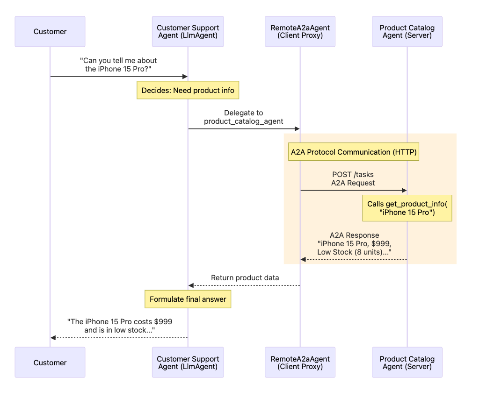

**A2A 协议通信详解：**

在底层协议层面，整个过程如下：

1. **远程A2A代理** 向 `http://localhost:8001`的 `/tasks`端点发送 HTTP POST 请求
2. **请求和响应数据** 均遵循 A2A 协议规范
3. **数据交换格式** 为标准化 JSON
4. **协议的核心** 是确保任何符合 A2A 标准的代理（无论使用何种语言或框架）都能相互通信

**正是这种标准化** 使得跨组织、跨语言的智能体通信成为可能！

---

**本次交互的具体过程：**

1. **客户提问** 关于 iPhone 15 Pro
2. **客服支持代理** 收到问题，并判断需要产品信息
3. **支持代理** 将任务委托给 `product_catalog_agent`子代理
4. **远程A2A代理** 将此任务转换为 A2A 协议请求
5. A2A 请求通过 HTTP 发送至 `http://localhost:8001`
6. **产品目录代理** 接收请求，并调用 `get_product_info("iPhone 15 Pro")`
7. **产品目录代理** 通过 A2A 响应返回产品信息
8. **远程A2A代理** 接收响应，并将其传回客服支持代理
9. **客服支持代理** 整合产品详情，形成最终答复
10. **客户** 收到完整、有用的回答

**展示的核心优势：**

- **透明性**：客服支持代理无需"知道"产品目录代理是远程服务
- **标准化协议**：采用 A2A 标准，可兼容任何符合该标准的代理
- **易于集成**：仅需一行代码即可添加：`sub_agents=[remote_product_catalog_agent]`
- **职责分离**： 产品数据存放在目录代理（由供应商维护） 客服逻辑存放在支持代理（由您的公司维护）

**实际应用场景**

这种模式能够实现：

- **微服务架构**：每个代理都是一个独立的服务
- **第三方集成**：轻松对接外部供应商的代理（如产品目录、支付处理等）
- **跨语言协作**：产品目录代理可以用 Java 编写，而客服代理可以用 Python
- **团队专业化**： 供应商团队维护产品目录 您的团队维护客服代理
- **跨组织协作**： 供应商在其基础设施上托管目录服务您通过 A2A 协议进行无缝集成

### 进阶学习

#### 🚀 Enhancement Ideas

Now that you understand A2A basics, try extending this example:

1. **Add More Agents**:
   - Create an **Inventory Agent** that checks stock levels and restocking schedules
   - Create a **Shipping Agent** that provides delivery estimates and tracking
   - Have Customer Support Agent coordinate all three via A2A
2. **Real Data Sources**:
   - Replace mock product catalog with real database (PostgreSQL, MongoDB)
   - Add real inventory tracking system integration
   - Connect to real payment gateway APIs
3. **Advanced A2A Features**:
   - Implement authentication between agents (API keys, OAuth)
   - Add error handling and retries for network failures
   - Use the alternative `adk api_server --a2a` approach
4. **Deploy to Production**:
   - Deploy Product Catalog Agent to Agent Engine
   - Update agent card URL to point to production server (e.g., `https://vendor-catalog.example.com`)
   - Consumer agents can now access it over the internet!

#### 📚 Documentation

**A2A Protocol**:

- [Official A2A Protocol Website](https://a2a-protocol.org/)
- [A2A Protocol Specification](https://a2a-protocol.org/latest/spec/)

**ADK A2A Guides**:

- [Introduction to A2A in ADK](https://google.github.io/adk-docs/a2a/intro/)
- [Exposing Agents Quickstart](https://google.github.io/adk-docs/a2a/quickstart-exposing/)
- [Consuming Agents Quickstart](https://google.github.io/adk-docs/a2a/quickstart-consuming/)

**Other Deployment Options**:

- [Deploy ADK Agents to Cloud Run](https://google.github.io/adk-docs/deploy/cloud-run/)
- [Deploy to Agent Engine](https://google.github.io/adk-docs/deploy/agent-engine/)
- [Deploy to GKE](https://google.github.io/adk-docs/deploy/gke/)

## Day5b 代理部署及MemoryBank

**第5节：使用 Vertex AI 记忆库实现长期记忆**

**记忆库解决了什么问题？**

您部署的智能体拥有会话记忆——它能记住您在聊天过程中对话内容。但一旦会话结束，它会忘记所有内容。每次新的对话都从头开始。

**问题所在：**

- 用户今天告诉智能体：“我更喜欢用摄氏温度”
- 第二天，用户询问天气 → 智能体仍用华氏温度回答（忘记了用户的偏好）
- 用户每次都需要重复自己的偏好

------

**💡 什么是 Vertex AI 记忆库？**

记忆库让您的智能体具备跨会话的长期记忆：

| 会话记忆           | 记忆库                   |
| ------------------ | ------------------------ |
| 单次对话记忆       | 所有对话记忆             |
| 会话结束即忘记     | 永久记忆                 |
| “我刚才说了什么？” | “我最喜欢的城市是哪里？” |

**工作原理：**

1. **对话过程中** - 智能体使用记忆工具搜索过去的事实
2. **对话结束后** - 智能体引擎提取关键信息（例如“用户偏好摄氏温度”）
3. **下次会话时** - 智能体自动回忆并使用这些信息

**示例：**

- **会话1**：用户说：“我更喜欢摄氏温度”
- **会话2**（几天后）：用户问：“东京天气如何？” → 智能体自动以摄氏温度回答 ✨

------

**🔧 记忆库与您的部署**

您的智能体引擎部署提供了记忆库所需的基础设施，但默认情况下并未启用。

**要使用记忆库，您需要：**

1. 在智能体代码中添加记忆工具（`PreloadMemoryTool`）
2. 添加回调函数，将对话保存到记忆库
3. 重新部署您的智能体

一旦配置完成，记忆库将自动工作——无需额外的基础设施！

------

**📚 进一步了解**

- **[ADK Memory Guide](https://google.github.io/adk-docs/sessions/memory/)** - Complete guide with code examples
- **[Memory Tools](https://google.github.io/adk-docs/tools/built-in-tools/)** - PreloadMemory and LoadMemory documentation
- **[Get started with Memory Bank on ADK](https://github.com/GoogleCloudPlatform/generative-ai/blob/main/agents/agent_engine/memory_bank/get_started_with_memory_bank_on_adk.ipynb)** - Sample notebook that demonstrates how to build ADK agents with memory
