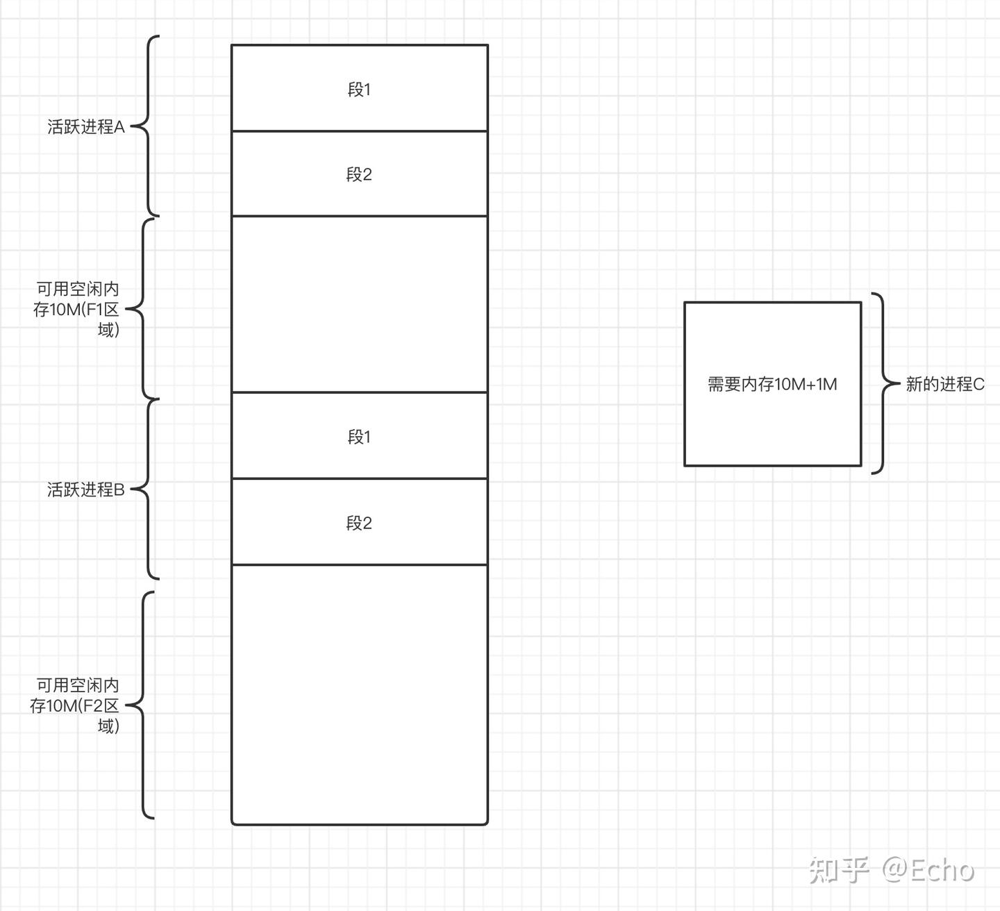

# KVCache

为加速推理而发明的kv矩阵缓存，每次推理将新的Token加入到之前的kv矩阵上，减少计算开销，但增加了内存压力。

- 使用kvcache需要满足因果性，这意味着新的输入不能改变之前的输入。Decoder-only可以使用，但是类似于BERT的双向模型，由于模型可以看到前后文，所以kvcache是无效的，decoder-only由于使用了掩码注意力，模型只能看到之前的词，因而可以使用；
- 位置编码时，类似ReRope，在增加新的token时，会将整个序列的位置编码进行调整，这意味着之前的embedding和新一次的token embedding是不同的，所以kvcache不成立。

流程图：


## 技术细节

- **缓存结构**

KV Cache 通常为每个注意力头维护独立的缓存，结构如下：

1. Key 缓存：形状为 [batch_size， num_heads， seq_len， head_dim]
2. Value 缓存：形状为 [batch_size， num_heads， seq_len， head_dim]

其中，seq_len 会随着生成过程动态增长，直到达到模型最大序列长度限制。

- **内存与速度的权衡**

KV Cache 虽然提升了速度，但需要额外的内存存储缓存数据。以 GPT-3 175B 模型为例，每个 token 的 KV 缓存约占用 20KB 内存，当生成 1000 个 token 时，单个样本就需要约 20MB 内存。在批量处理时，内存消耗会线性增加。

实际应用中需要根据硬件条件在以下方面进行权衡：

1. 最大缓存长度（影响能处理的序列长度）
2. 批量大小（影响并发处理能力）
3. 精度选择（FP16 比 FP32 节省一半内存）
4. 滑动窗口机制

当处理超长序列时，一些模型（如 Llama 2）采用滑动窗口机制，只保留最近的 N 个 token 的 KV 缓存，以控制内存占用。这种机制在牺牲少量上下文信息的情况下，保证了模型能处理更长的对话。

```python
class CachedSelfAttention(nn.Module):
    def __init__(self, embed_dim, num_heads):
        super().__init__()
        self.embed_dim = embed_dim
        self.num_heads = num_heads
        self.head_dim = embed_dim // num_heads
        
        # 定义投影矩阵
        self.q_proj = nn.Linear(embed_dim, embed_dim)
        self.k_proj = nn.Linear(embed_dim, embed_dim)
        self.v_proj = nn.Linear(embed_dim, embed_dim)
        self.out_proj = nn.Linear(embed_dim, embed_dim)
        
        # 初始化缓存
        self.cache_k = None
        self.cache_v = None
    
    def forward(self, x, use_cache=False):
        batch_size, seq_len, embed_dim = x.shape
        
        # 计算Q、K、V
        q = self.q_proj(x).view(batch_size, seq_len, self.num_heads, self.head_dim).transpose(1, 2)
        k = self.k_proj(x).view(batch_size, seq_len, self.num_heads, self.head_dim).transpose(1, 2)
        v = self.v_proj(x).view(batch_size, seq_len, self.num_heads, self.head_dim).transpose(1, 2)
        
        # 如果使用缓存且缓存存在，则拼接历史KV
        if use_cache and self.cache_k is not None:
            k = torch.cat([self.cache_k, k], dim=-2)
            v = torch.cat([self.cache_v, v], dim=-2)
        
        # 如果使用缓存，更新缓存
        if use_cache:
            self.cache_k = k
            self.cache_v = v
        
        # 计算注意力分数（注意这里的k是包含历史缓存的）
        attn_scores = (q @ k.transpose(-2, -1)) / (self.head_dim ** 0.5)
        attn_probs = F.softmax(attn_scores, dim=-1)
        
        # 应用注意力权重
        output = attn_probs @ v
        output = output.transpose(1, 2).contiguous().view(batch_size, seq_len, embed_dim)
        
        return self.out_proj(output)
    
    def reset_cache(self):
        """重置缓存，用于新序列的生成"""
        self.cache_k = None
        self.cache_v = None
```

生成时，只输入新的token

```python
def generate_text(model, input_ids, max_length=50):
    # 初始化模型缓存
    model.reset_cache()
    
    # 处理初始输入
    output = model(input_ids, use_cache=True)
    next_token = torch.argmax(output[:, -1, :], dim=-1, keepdim=True)
    generated = [next_token]
    
    # 生成后续token
    for _ in range(max_length - 1):
        # 只输入新生成的token
        output = model(next_token, use_cache=True)
        next_token = torch.argmax(output[:, -1, :], dim=-1, keepdim=True)
        generated.append(next_token)
        
        # 如果生成结束符则停止
        if next_token.item() == 102:  # 假设102是[SEP]的id
            break
    
    return torch.cat(generated, dim=1)

```

## 优化策略

1. **分页** **KV** **Cache（Paged KV Cache）**：借鉴内存分页机制，将连续的 KV 缓存分割成固定大小的块，提高内存利用率，代表实现有 vLLM。
2. **动态缓存管理**：根据输入序列长度动态调整缓存大小，在批量处理时优化内存分配。
3. **量化缓存**：使用 INT8 或 INT4 等低精度格式存储 KV 缓存，在牺牲少量精度的情况下大幅减少内存占用。
4. **选择性缓存**：对于一些不重要的层或注意力头，选择性地不进行缓存，平衡速度和内存。

# Paged KV cache

## 内存分页

### 段式内存访问

CPU访问内存的方式，即”段基址：段内偏移地址“的方式，在我们使用这种方式去访问内存时是访问的真实的物理内存。

物理内存是线性连续，如果内存过小，无法进行换入换出操作。当有进程间的内存分割有空余但不连续时，可能无法容纳新的进程。



为了解决线性地址等同于物理地址问题，需要将线性地址和物理地址解绑，解绑后线性地址连续，但物理地址可以不连续，这需要借助分页机制。

### 分页机制

cpu不打开分页机制时，默认分段方式进行。即通过段基址和段内偏移地址计算出来的内存地址时真实的物理地址。

cpu打开分页机制后，上述地址不再是真实物理地址而是虚拟地址，虚拟地址需要转换才能变为物理地址

作用：

- 将线性地址转换成物理地址
- 用大小相等页代替大小不等的段

页表中能包含很多页表项，大小固定4字节，页表中记录的是物理地址

如何通过页表获取真实物理地址，首先我们得知道页表的存储位置在哪？

在分页机制打开，我们需要将**页表地址加载到控制寄存器cr3中，保存的是物理地址**，以后通过cr3我们就可以获取到页表的地址。

一个页表项对应一个页，虚拟地址的高20位作为页表项的索引，由于每个页表项占用4字节，所以这高20位的索引值乘以4然后再加上cr3中的页表地址，得到的结果即为该页表项的物理地址。

上述我们已经可以定位到页表项的物理地址了，那么下面就是如何从页表项中获取我们需要访问的物理地址。

从页表项中取回实际要访问的物理地址，然后将其与虚拟地址的低12位相加，即可得到我们需要访问的物理地址。**由于每个页固定位4KB，所以虚拟地址的低12位正好可以表示页内偏移。**

# 混合注意力机制的KVcache设计

