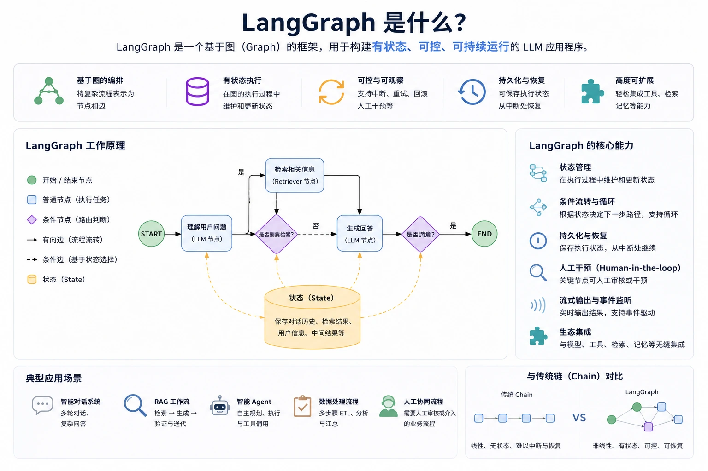

# 关于langgraph的个人理解

## 全局状态



全局状态State是Langgraph的整体哲学，通过解耦，数据只在全局状态中流转。每个节点只负责执行，整体编排交给外挂容器。以下为简单的手搓版本：

这里用了控制反转的设计思想（IoC）：**将程序流程的控制权从应用程序代码转移给外部容器或框架**。

```python
from typing import List, Optional, Dict
from pydantic import BaseModel, Field
import uuid

class AgentState(BaseModel):
    user_id: uuid.UUID = Field(uuid.uuid4, description="用户id")
    user_query: str = Field(..., description="用户提问")
        
class Node:
    """
    节点基类
    包括当前节点状态，下一个节点的引用，以及执行节点的逻辑方法
    """

    def execute(self, agent_state: AgentState) -> None:
        """
        执行节点逻辑
        需要在子类中实现具体的执行逻辑
        :param agent_state: Agent全局状态
        """
        raise NotImplementedError("子类必须实现execute方法")
        
class Graph:
    """
    节点图模型
    管理节点之间的关系和执行逻辑
    """
    def __init__(self):
        self.nodes: Dict[str, Node] = {}
        self.edges: Dict[str, str] = {}

    def add_node(self, node_name, Node = None):
        """
        添加节点到图中
        :param Node: 节点实例
        """
        self.nodes[node_name] = Node
    
    def add_edge(self, Node_from: str, Node_to: str):
        """
        添加节点之间的边
        :param Node_from: 起始节点
        :param Node_to: 目标节点
        """
        self.edges[Node_from] = Node_to
    
    def run(self, initial_data: Dict[str, Any]):
        """
        执行节点图，从初始数据开始，按顺序执行节点
        :param initial_data: 初始数据字典
        """
        agent_state = AgentState(**initial_data)
        current_node_name = "start"

        node_instance = self.nodes.get(current_node_name)

        while current_node_name != "end" and node_instance is not None:
            try:
                node_instance.execute(agent_state)
                current_node_name = self.edges.get(current_node_name, "end")
                node_instance = self.nodes.get(current_node_name)
            except Exception as e:
                print(f"节点 {current_node_name} 执行失败: {e}")
                break
```

