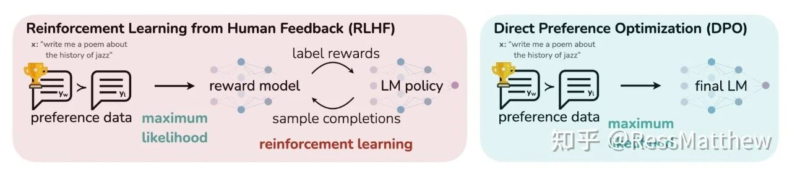
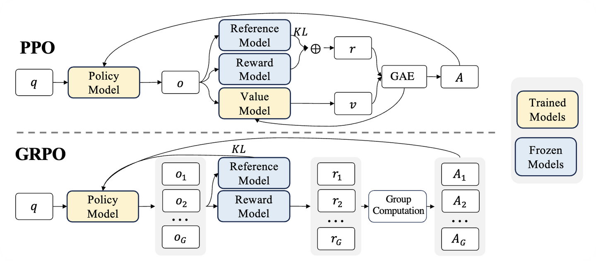

# 人类偏好对齐

提到 RLHF（Reinforcement Learning from Human Feedback，基于人类反馈的强化学习），我们得先搞清楚它到底解决了什么问题。

传统的 SFT（监督微调）教会了模型“如何回答”，但没教会它“如何答得好”。

什么是“好”？比如更安全、更幽默、更符合逻辑、拒绝有害问题。这个“好”的标准是模糊且复杂的，很难用 SFT 的数据来定义。

RLHF 的天才之处在于它引入了**“品味裁判”**：

- **收集偏好：**先让人类对模型的各种答案进行排序（比如，A 答案比 B 答案好）。
- **训练裁判：**用这些排序数据训练一个奖励模型。这个 RM 就像一个“AI 裁判”，它学会了模拟人类的复杂品味和价值观。
- **强化学习：**最后，让大模型（LLM）通过强化学习的方式，不断生成答案，并由这个“AI 裁判”来打分。LLM 的目标就是调整自己（优化策略），去专门生成那些能从“AI 裁判”那里拿高分的答案。

而 **PPO（Proximal Policy Optimization，近端策略优化），**就是实现这“最后一步”最经典、最正统的强化学习算法。ChatGPT 最初的惊艳效果，功勋章里有它的一半。

## PPO

PPO 的核心哲学是标准的强化学习：它极其强调探索。通过 Critic 模型的辅助，它不仅看最终结果，还试图评估每一步 Token 生成的“潜在价值”。

但如果你亲手训过 PPO，你大概率经历过显存爆炸和 Loss 横跳的绝望。

为什么？因为标准的 PPO 实在太“重”了。为了让 LLM 学会“像人一样说话”（用奖励信号指导生成），PPO 直接拉来了四个模型凑了一桌麻将：

- **Policy Model（策略模型，Actor）：**干活的，负责生成回答（我们要训的就是它）。

- **Value Model（价值模型，Critic）：**当裁判的，预估当前状态未来能拿多少分。

- **Reference Model（参考模型）：**照镜子的，防止 Actor 练歪了，得时不时回头看看原始模型咋说的（KL 散度约束）。

- **Reward Model（奖励模型）：**打分的，代替人类给最终生成的答案打分。

划重点：**这四个模型在训练时都要塞进显存里。对于千亿参数的模型来说，这简直是工程噩梦。**

## DPO

就在大家被 PPO 折磨得死去活来时，DPO（Direct Preference Optimization，直接偏好优化）横空出世。

DPO 的思路极其性感：既然我们只想让模型偏好 A 答案胜过 B 答案，为什么非要训练一个复杂的 Reward 模型和 Critic 模型呢？

它直接跳过了中间商，用一个简单的分类损失函数，直接在偏好数据对上做微调（其中 P~θ~ 是策略模型，P~ref~ 是参考模型）：

​					$ max([logP_\theta(好) - logP_{ref}(好)]-[logP_\theta(坏) - logP_{ref}(坏)])$

一夜之间，RLHF 变得像 SFT（监督微调）一样简单稳定，显存占用也大幅下降。

但好景不长，工业界很快发现 DPO 的局限性：**它太依赖 SFT 基座模型的能力了**。

因为它本质上是在做“对比学习”，而不是真正的“强化探索”。如果基座模型从来没生成过某个高分答案，DPO 很难凭空“悟”出来。

## GRPO

这时候，DeepSeek 在其系列模型中采用的 GRPO（Group Relative Policy Optimization，组相对策略优化）开始受到关注。

**GRPO 的核心洞察是：**PPO 的 Critic 模型太占资源了，能不能把它干掉？

答案是可以。GRPO 采用了一种“组团打分”的策略：

- **组团生成：**对于同一个问题，让模型一口气生成一组（比如 8 个）不同的答案。
- **组内竞争：**用 Reward 模型给这 8 个答案分别打分。
- **相对优势：**算出这组答案的平均分。比平均分高的，奖励；比平均分低的，惩罚。

妙在哪？ 它用“组平均值”代替了 PPO 中那个昂贵的 Critic 模型来充当 Baseline。

这就好比考试，我不要求你达到一个绝对的 90 分（Critic 的预估值），我只要求你比你们班这次考试的平均分高就行。

GRPO 成功地在 PPO 的“探索能力”和 DPO 的“训练效率”之间找到了一个极其漂亮的平衡点：它保留了 RL 的探索精神，却甩掉了 Critic 这个沉重的包袱。

## DAPO 

当然，技术永远在迭代。GRPO 也有自己的问题：

- **无效内卷：**如果一组 8 个答案都非常完美，或者都烂得一塌糊涂，它们相对于“组平均分”的差异就很小。这时候模型学不到什么有效信息，浪费了算力。
- **保守陷阱：**为了防止模型训崩，PPO 和 GRPO 都会用 Clipping（裁剪）机制，限制模型每次更新的幅度。但这有时候会“误伤”那些模型灵光一现生成的绝妙答案。

于是，DAPO（Decoupled Clip and Dynamic sAmpling Policy Optimization，解耦裁剪与动态采样策略优化）登场了，它对 GRPO 进行了两处关键的“手术”：

**手术一：动态采样（拒绝无效内卷）**

DAPO 加了一个过滤器，太简单（全对）和太难（全错）的数据组直接跳过不练，只死磕那些模型“似懂非懂”的数据。

**手术二：解耦裁剪（允许灵光一现）**

传统的 Clipping 是双向限制的。DAPO 说：如果模型这次更新是往“好”的方向大步迈进，我们为什么要拦着？

它解耦了裁剪范围，允许更高的上限（Upside），鼓励模型更大胆地探索高分区域。

更有意思的是，DAPO 在实践中甚至开始尝试去掉 KL 散度约束。

这是一个非常大胆的举动，意味着它允许模型更大幅度地偏离原始基座，去探索全新的解空间——这对于追求极高推理能力（如数学证明、复杂代码）的场景可能至关重要。

## 总结

如果把大模型比作一个学生：

- PPO 是请了 4 个私教（模型）全方位辅导，效果好但学费极其昂贵。
- DPO 是直接刷《五年高考三年模拟》，只看标准答案，效率高但缺乏举一反三的能力。
- GRPO 是搞“学习小组”，大家互相批改作业，比平均分好的受表扬，既省了老师又保持了竞争。
- DAPO 则是升级版的“精英学习小组”，只攻坚难题，并且鼓励尖子生“抢跑”。

光有比喻还不够，为了让大家看得更清楚（也方便面试时快速回忆），我把这四种算法的核心‘进化’和‘取舍’浓缩成了下面这张表：

PPO，DPO，GRPO，DAPO 核心对比：

从目前的趋势看，**回归强化学习（RL）本质、增强模型的自主探索能力**，正在成为新的共识。

GRPO 及其后续变体，很可能在未来一段时间内取代 DPO，成为高性能大模型训练标配。