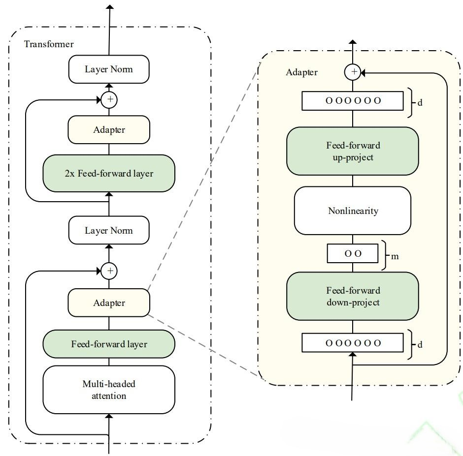
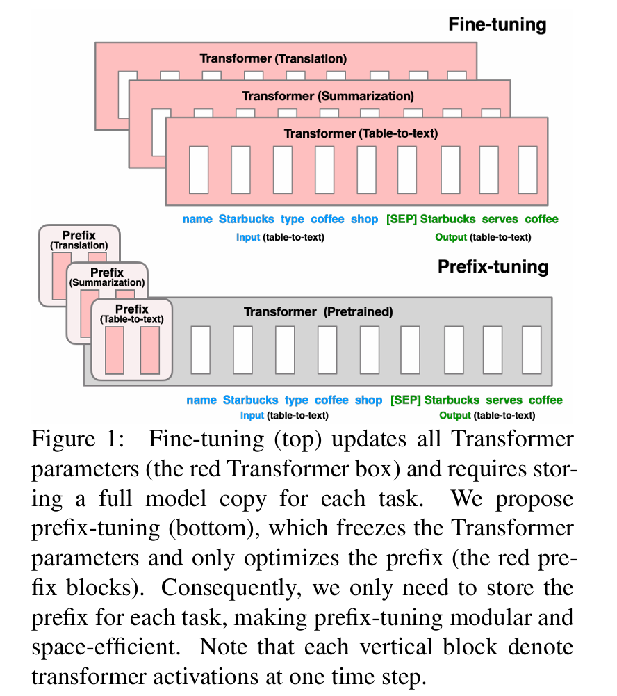

# Lora & PEFT method

## PEFT方法分类

###  附加方法

保持原有模型参数不变，引入少量新的可训练参数。这些新参数位于特定的模型架构之中。

- 适配器微调：添加适配器层，对原有模型参数冻结。相当于额外训练一个补丁附加到原来的模型参数上，实现微调效果。



```python
import torch
import torch.nn as nn

class Adapter(nn.Module):
    def __init__(self, original_layer, down_dim):
        """
        参数：
        w_original 原始模型层（如nn.Linear, nn.Conv2d等）
        down_dim 降维的维度数
        """
        super().__init__()
        self.original_layer = original_layer
        self.down_dim = down_dim
        
        # 冻结原始层参数
        for param in self.original_layer.parameters():
            param.requires_grad = False
        
        # 获取输入维度
        if hasattr(original_layer, "in_features"):
            in_dim = original_layer.in_features
            out_dim = original_layer.out_features
        elif hasattr(original_layer, "in_channels"):
            in_dim = original_layer.in_channels
            out_dim = original_layer.out_features
        else:
            raise ValueError("无法确定原始层的输入维度")
            
        self.down_proj = nn.Linear(in_dim, down_dim, bias=False)
        self.up_proj = nn.Linear(down_dim, out_dim, bias=False)
        self.activation = nn.ReLU()
        
        # 初始化适配器权重为接近0的小值，确保训练初期适配器影响很小
        nn.init.zeros_(self.up_proj.weight)
                
    def forward(self, X):
        # 原始层前向传播
        original_output = self.original_layer(X)
        
        # 适配器前向传播
        adapter_output = self.down_proj(X)
        adapter_output = self.activation(adapter_output)
        adapter_output = self.up_proj(adapter_output)
        
        # 残差连接：原始输出 + 适配器输出
        output = original_output + adapter_output
        return output
```


- [[*前缀微调* **Prefix-Tunning**]](./Paper/Prefix-Tuning: Optimizing Continuous Prompts for Generation.pdf)：将一系列可训练的连续向量（即“前缀”）添加到每个注意力层的输入之前。这些前缀在微调过程中作为任务特定的指令被学习。



```python
import torch
import torch.nn as nn
import torch.nn.functional as F

class PrefixTunning(nn.Module):
    def __init__(self, model, prefix_len, hidden_size, num_heads, num_layers):
    """
    	参数：
    	model : 初始模型
    	prefix_len : 前缀长度，相当于在T的维度增加
    	hidden_size : 隐藏层维度
    	num_layers : Transformer层层数
    """
    super().__init__()
    self.model = model
    self.prefix_len = prefix_len
    self.hidden_size = hidden_size
    self.num_heads = num_heads
    self.num_layers = num_layers
    
    # 冻结初始模型参数
    for p in self.model.parameters():
        p.requires_grad = False
    
    # 为模型每一层创建前缀
    self.prefix_embd = nn.Parameters(
    	torch.rand(prefix_len, hidden_size)
    )
    
    # 为每一层的key和value创建前缀
    self.prefix_keys = nn.ParameterList([
        nn.Parameter(torch.randn(prefix_len, hidden_size))
        for _ in range(num_layers)
    ])
    self.prefix_values = nn.ParameterList([
        nn.Parameter(torch.randn(prefix_len, hidden_size))
        for _ in range(num_layers)
    ])
    
    def forward(self, input_ids, attention_mask=None):
        B, T, C = input_ids.shape
        
        # 获取原始输入嵌入
        input_embd = self.model.get_input_embeddings()(input_ids)
    	
        # 为每个样本添加前缀
        prefix_embd = self.prefix_embeddings.unsqueeze(0).expand(B, -1, -1)
        combined_embd = torch.cat([prefix_embd, input_embd])
        
    	# 扩展注意力掩码以包含前缀
        if attention_mask is not None:
            prefix_mask = torch.ones(B, self.prefix_length, device=input_ids.device)
            combined_mask = torch.cat([prefix_mask, attention_mask], dim=1)
        else:
            combined_mask = None
        
        # 修改模型的注意力机制以包含前缀
        outputs = self.custom_forward_with_prefix(input_embeds, combined_mask)
        return outputs
    
    def custom_forward_with_prefix(self, input_embeds, attention_mask):
        """自定义前向传播，在每一层的注意力机制中注入前缀"""
        
        # 这里需要重写Transformer的forward方法
        # 在实际实现中，这通常需要修改模型的源代码
        # 或者使用hook机制来注入前缀
        
        # 简化示例：实际实现会更复杂
        hidden_states = input_embeds
        
        for layer_idx, layer in enumerate(self.model.transformer.h):
            # 获取当前层的前缀key和value
            prefix_key = self.prefix_keys[layer_idx]
            prefix_value = self.prefix_values[layer_idx]
            
            # 扩展前缀到batch大小
            batch_size = input_embeds.shape[0]
            prefix_key = prefix_key.unsqueeze(0).expand(batch_size, -1, -1)
            prefix_value = prefix_value.unsqueeze(0).expand(batch_size, -1, -1)
            
            # 在这里修改注意力机制来包含前缀
            # 实际实现需要重写attention计算
            layer_outputs = self.prefix_attention_layer(
                layer, hidden_states, prefix_key, prefix_value, attention_mask
            )
            hidden_states = layer_outputs[0]
        
        return hidden_states
```


- *提示微调* 是一种简化方法，其中可训练向量仅添加到初始输入嵌入序列中。像 P-Tuning 这样的变体进一步完善了这一思路。

附加方法的主要优势在于预训练知识（冻结权重）与任务特定适应（新参数）之间的明确分离。这种模块化简化了多任务学习和部署，因为可以按需加载不同的适配器或前缀，而无需修改大型基础模型。

### 选择性方法

选择性方法采取更直接的方法，即仅解冻并微调原始预训练模型参数中经过仔细选择的*一小部分*。其余参数保持冻结。

示例包括：

- 仅微调网络中的偏置项。
- 选择性地更新最后一层或对适应任务很重要的特定层。
- 像 FishMask 或 Diff Pruning 这样更复杂的技术尝试识别并训练对目标任务很重要的子网络。

尽管直观，选择性方法的有效性在很大程度上取决于识别出要微调的*正确*参数子集。这种识别可能不简单。虽然在训练过程中可能比完全微调的内存消耗少，但它们可能需要比附加方法或重参数化方法微调更多的参数才能达到相似的性能。此外，管理不同的任务适应需要存储修改后参数的单独副本或应用复杂的修补机制。

### 重参数化方法

重参数化方法修改了权重更新的表示或应用方式，而不是直接添加参数或选择子集。此类中最突出的技术使用低秩近似。

论文：[低秩适应LoRA](./Paper/LoRA Low-Rank Adaptation of Large Language Models.pdf)

预训练模型已经包含了大量的通用知识，当针对特定任务进行微调时，如情感分析或者代码生成，我们没有从根本上改变原有通用模型对相关任务的理解。而是通过微调来使其现有的能力适应特定的任务和模式。这种引导和适配增量的过程，可以通过在**高维权重空间**沿着相对较少的方向或维度修改原始权重来表示。

也就是说，通用模型是一个全才，但在特有的指示方向上并没有那么强势，这也就是其高维空间向量中数值表达较少的方向，这种理念又与SVD分解相似。通过分解得到低秩矩阵，减少学习参数。ΔW∈Rd×kΔ*W*∈R*d*×*k*
$$
W = W_0 + \Delta W \\
$$

$$
\Delta W ≈ BA
$$

$$
h = W_0x + \Delta W_0x = W_0x +BAx
$$

$$
缩放因子： \alpha \space {对BA施加更新幅度，使用 \frac{\alpha}{r}进行缩放，有助于稳定训练} \\
h = W_0x + \frac{\alpha}{r}BAx
$$

一般而言，使用随机高斯值初始化A，零初始化B。这是为了保证训练开始时BA为0，使得初始LoRA模型与原有预训练模型完全一致

- 参数量：r * （d + k)   r << min(d, k)，数量远小于微调w_0的 d * k参数量。增加r也会增加内存需求量
- 近似能力：r决定了BA矩阵秩的上限。更高的r允许BA近似更复杂的Δ*W* 。如果真实固有秩较高，r较小可能导致欠拟合。如果过高，可能通过捕捉噪声或虚假相关性导致数过拟合，并且增加计算成本。
- 选取r的方法：
  1. 测试，r=4，8，16等等值
  2. 计算开销，资源有限需要权衡
  3. 性能饱和，随着r的增加，会有临界值，达到之后性能会趋于平稳
  4. 任务复杂度
- 选取α。α过高更侧重LoRA的调整。加速适应目标任务，但可能产生对与训练阶段的遗忘；α较低，减小LoRA影响，更好的保留基础模型的能力，提高泛化能力
  1. 设定α=r
  2. 设定α为固定值，如16，32，64
  3. 将α视为独立的超参数。使用网格搜索、随机搜索或者贝叶斯优化进行系统调整。

LoRA层的实现：

```python
import torch
import torch.nn as nn
import torch.nn.functional as F
import math

class LoRALinear(nn.Module):
    """
    将标准 Linear 层替换为LoRA层
    """
    def __init__(self, original_layer, alpha, rank, lora_drop):
        super().__init__()
        self.in_features = original_layer.in_features
        self.out_features = original_layer.out_features
        self.original_layer = original_layer
        self.alpha = alpha
        self.rank = rank
        self.lora_drop = lora_drop
        
        # 将原始权重和偏置注册为不可训练的参数
        self.weight = nn.Parameter(original_layer.weight.detach().clone())
        self.weight.requires_grad = False

        if original_layer.bias is not None:
            self.bias = nn.Parameter(original_layer.bias.detach().clone())
            self.bias.requires_grad = False
        else:
            # 使用 register_parameter 确保 'bias' 属性存在，即使它为 None
            self.register_parameter('bias', None)
            
        # 创建并初始化AB
        self.lora_A = nn.Parameter(torch.Tensor(rank, self.in_features))
        self.lora_B = nn.Parameter(torch.Tensor(self.out_features, rank))
        
        # LoRA 路径的可选 dropout 层
        if lora_drop > 0.0:
            self.lora_drop = nn.Dropout(p=lora_drop)
        else:
            self.lora_drop = nn.Identity() # 作为一个直通层
        
        # 缩放因子
        if rank > 0:
            self.scaling = self.alpha / self.rank
        else:
            self.scaling = 1.0 # 如果秩为 0，避免除以零

        # 初始化 LoRA 参数
        self.reset_lora_parameters()
        
	 def reset_lora_parameters(self):
        """ 初始化 LoRA 矩阵 A 和 B。 """
        if self.rank > 0:
            # 使用 Kaiming uniform 初始化 A，以获得更好的梯度流动
            nn.init.kaiming_uniform_(self.lora_A, a=math.sqrt(5))
            # 将 B 初始化为零，以便初始适应项为零
            nn.init.zeros_(self.lora_B)
            
	def forward(self, x: torch.Tensor) -> torch.Tensor:
        """ 执行修改后的前向传播。 """
        # 计算原始（不变的）线性变换
        # 使用 F.linear 可以避免在混合张量时出现设备放置问题
        result = F.linear(x, self.weight, self.bias)

        # 如果 rank > 0，计算 LoRA 调整
        if self.rank > 0:
            # 在 LoRA 矩阵之前对输入 x 应用 dropout
            x_lora = self.lora_dropout(x)

            # 计算 x @ A^T
            # 输入 x_lora (N, d_in), 权重 lora_A (r, d_in) -> 输出 (N, r)
            after_A = F.linear(x_lora, self.lora_A.T)

            # 计算 (x @ A^T) @ B^T
            # 输入 after_A (N, r), 权重 lora_B (d_out, r) -> 输出 (N, d_out)
            lora_adjustment = F.linear(after_A, self.lora_B.T)

            # 将缩放后的 LoRA 调整添加到原始结果中
            result += lora_adjustment * self.scaling

        return result
    
    def train(self, mode: bool = True):
        """ 确保原始权重在训练期间保持不变。 """
        super().train(mode)
        # 在模式更改后显式设置 requires_grad 为 False
        self.weight.requires_grad = False
        if self.bias is not None:
            self.bias.requires_grad = False
        # 确保 LoRA 参数可训练（它们默认是可训练的）
        # self.lora_A.requires_grad = True
        # self.lora_B.requires_grad = True

    def extra_repr(self) -> str:
        """ 向模块表示添加 LoRA 特定信息。 """
        return (f'in_features={self.in_features}, out_features={self.out_features}, '
                f'rank={self.rank}, alpha={self.alpha}')
```

LoRA也可应用于卷积层或嵌入层，实际使用中主要应用在Linear层中，尤其是**注意力机制及前馈网络**

### LoRA在Transformer中的应用

主要考虑LoRA在何处有效融合进Transformer架构。Trams former通常包含MHA以及FFN，这些依赖线性变换，是LoRA适应的主要目标。

常见调整MHA以及FNN

```python
import torch
import torch.nn as nn
import math

class LoRALinear(nn.Module):
    def __init__(self, original_layer, rank, alpha):
        """
        original_layer : 原始线性层
        rank ： 秩
        alpha ： 缩放规模
        """
        super().__init__()
        self.original_layer = original_layer
        self.rank = rank
        self.alpha = alpha

        # 冻结原始参数
        for p in original_layer.parameters():
            p.requires_grad = False

         # 创建LoRA矩阵A和B（作为Parameter，不是Linear层）
        self.lora_A = nn.Parameter(torch.Tensor(rank, original_layer.in_features))   # (r, d_in)
        self.lora_B = nn.Parameter(torch.Tensor(original_layer.out_features, rank))  # (d_out, r)

        # 初始化lora，A采用kaiming均匀分布，B使用0初始化
        nn.init.kaiming_uniform_(self.lora_A, a=math.sqrt(5))
        nn.init.zeros_(self.lora_B)
    
	def forward(self, X):
        # 冻结参数传播结果
        result = self.original_layer(X)
        
        if self.rank > 0:
        # 更高效的计算：x -> A -> B，避免大矩阵
        lora_result = (x @ self.lora_A.t()) @ self.lora_B.t()  # x @ A^T @ B^T
        result += lora_result * (self.alpha / self.rank)
        
        return result

original_layer = nn.Linear(in_features=512, out_features=512)
lora_layer = LoRALinear(original_layer, rank=8, alpha=16)
```

---

补充：

```python
# nn.Linear 和 nn.Parameters的区别
# nn.Parameter是一个可训练的张量
self.lora_A = nn.parameter(torch.Tensor(rank, in_features))

# nn.Linear是完整的神经网络层
nn.Linear(rank, in_features)包含了weight和bias
```

