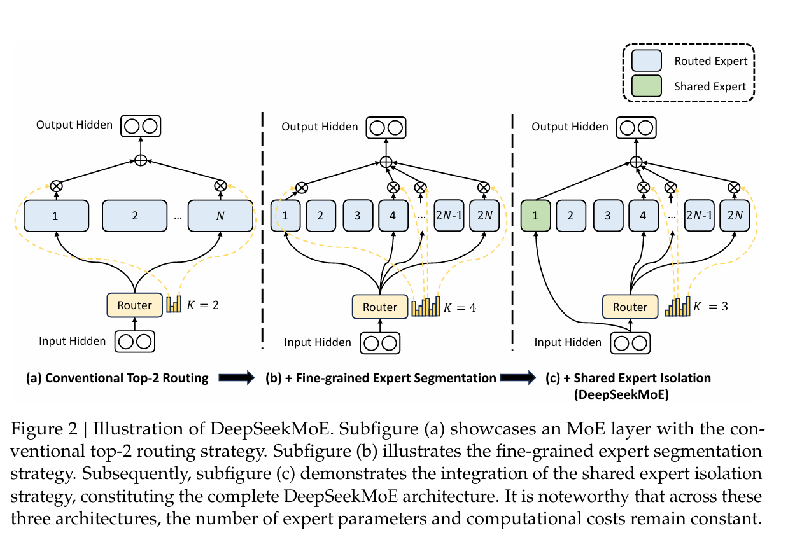

# MoE

论文：[[DeepSeekMoE Towards Ultimate Expert Specialization in Mixture-of-Experts Language Models]](./Paper/DeepSeekMoE Towards Ultimate Expert Specialization in Mixture-of-Experts Language Models.pdf)

DeepSeekMoE架构：设立n个专家，激活其中的k个；设立共享专家，使得部分通用知识在模型中流通。整体架构如下图所示

