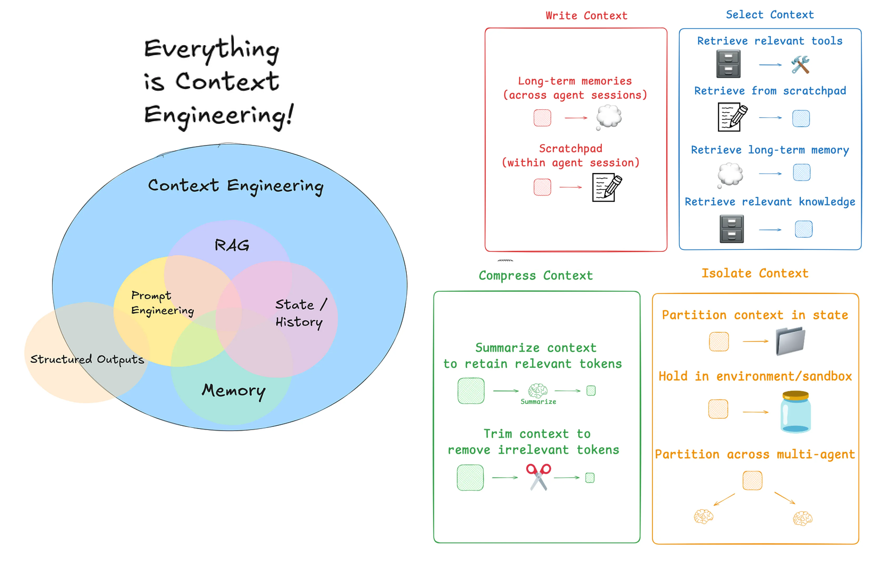
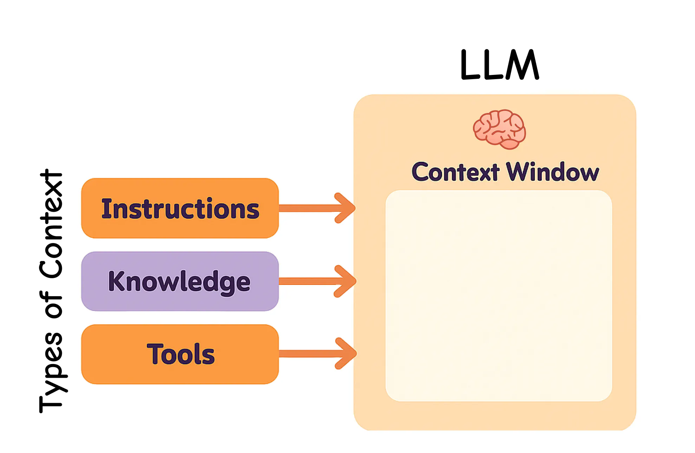
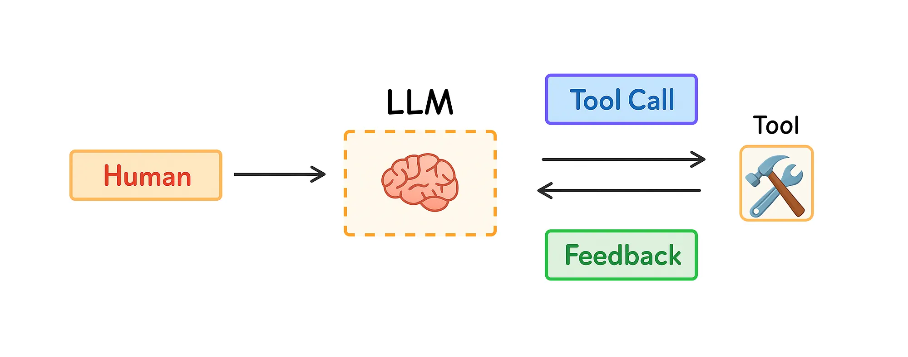
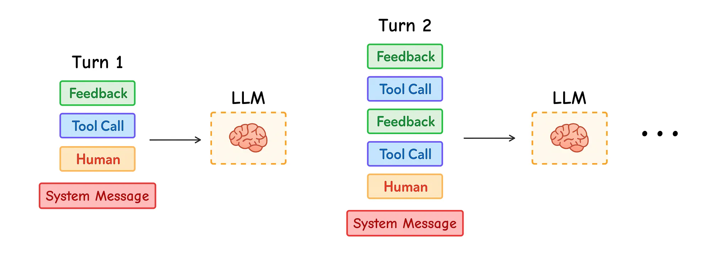
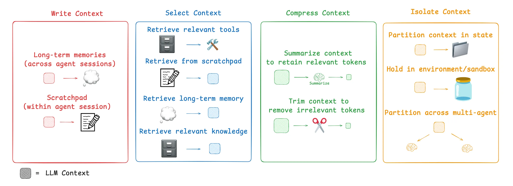

# Optimizing LangChain AI Agents with Contextual Engineering

AI工程师现在从提示词工程师往上下文工程师转变，因为:

> 上下文工程师关注于为AI提供正确的背景、工具，让LLM的回答更加智能和有用。

https://levelup.gitconnected.com/optimizing-langchain-ai-agents-with-contextual-engineering-0914d84601f3

本文将探索LangChain以及LangGraph两个有力工具创建AI agents、RAG app以及LLM apps，并将他们用于上下文工程，以此有效提高AI代理。

## 什么是上下文工程

LLMs就像一个新型操作系统。LLM就像是CPU，它的上下文窗口就像RAM，上下文窗口对于不同的信息来说，空间是有限的。

> 就像操作系统决定什么进入RAM，上下文工程就是帮助LLM选择保留那些上下文

当创建LLM应用时，我们需要管理不同类型的上下文。上下文工程包括以下几种类型：

- 指令：提示词、例子、记忆以及工具描述
- 知识：事实、储存的信息以及记忆
- 工具：工具调用的反馈以及结果

今年，更多的人们关注于agents因为LLMs有着更好的思维方式以及使用工具的能力。Agents通过使用LLMs和工具，基于工具的反馈决定下一步的任务，使得他们可以执行更长任务。

但是长任务和收集太多工具的结果会使用很多的token。这带来了新的问题：上下文窗口会溢出，花费和延迟会增加，并且agent可能会越来越差

Drew Breunig解释了多长的上下文会损害模型表现，包括：

- Context Poisoning: [when a mistake or hallucination gets added to the context](https://www.dbreunig.com/2025/06/22/how-contexts-fail-and-how-to-fix-them.html?ref=blog.langchain.com#context-poisoning)
- Context Distraction: [when too much context confuses the model](https://www.dbreunig.com/2025/06/22/how-contexts-fail-and-how-to-fix-them.html?ref=blog.langchain.com#context-distraction)
- Context Confusion: [when extra, unnecessary details affect the answer](https://www.dbreunig.com/2025/06/22/how-contexts-fail-and-how-to-fix-them.html?ref=blog.langchain.com#context-confusion)
- Context Clash: [when parts of the context give conflicting information](https://www.dbreunig.com/2025/06/22/how-contexts-fail-and-how-to-fix-them.html?ref=blog.langchain.com#context-clash)

Anthropic在他们的研究中（ [in their research](https://www.anthropic.com/engineering/built-multi-agent-research-system?ref=blog.langchain.com)）强调了上下文管理的重要性：

>  agents经常有上百轮的对话，因此管理上下文至关重要

所以，人们当下如何解决这个问题呢？通常的策略包括：

- 写：创建清晰和有用的上下文、
- 选择：只选择最相关的内容
- 压缩：压缩上下文来节省空间W
- 隔离：保持不同类型的上下文隔离

`LangGraph`被创造出来支撑这些策略。我们会一个个学习这些组件，并且看看他们如何让我们的AI agent工作的更好。

## 从零开始LangGraph

就像人类记忆最近的工作记笔记一样，agents可以做同样的事情，通过使用`scratchpad`[https://www.anthropic.com/engineering/claude-think-tool]。它存储了上下文窗口外的信息，因此agent可以在任何需要的时候访问它。