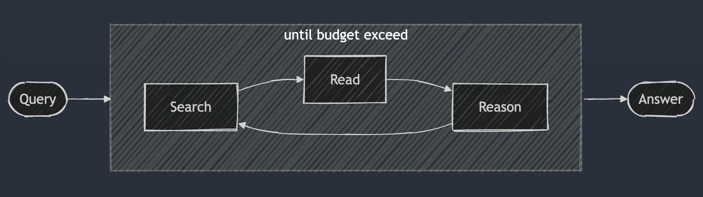
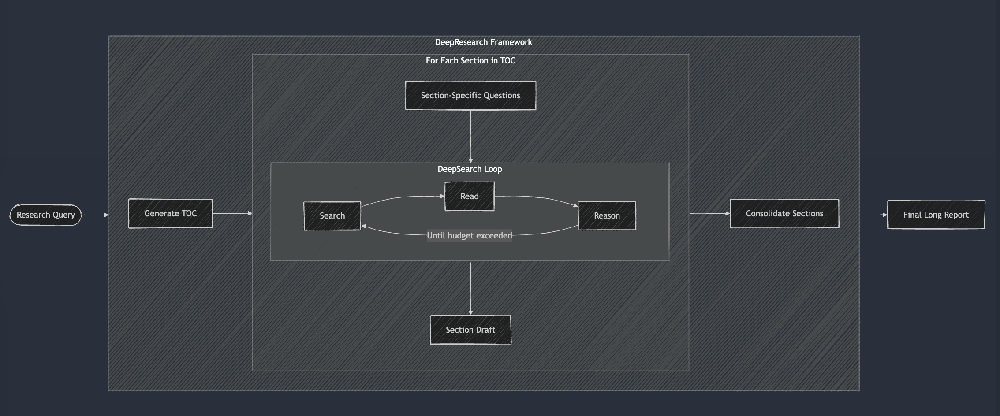

# DeepSearch、DeepResearch

**DeepSearch（深度搜索）**：通过"搜索-阅读-推理"的迭代循环机制，持续进行信息检索、内容分析和逻辑推理，直到找到最优答案。它突破了传统RAG单次检索的局限，能够处理复杂查询并生成附带数据支撑的精准答案。

**DeepResearch（深度研究）**：在DeepSearch基础上构建的结构化框架，专门用于生成高质量的长篇研究报告。它能够自动化完成从研究规划、信息检索到报告生成的完整流程，生成包含清晰引用来源的专业级研究报告。

DeepSearch[DeepSearch/DeepResearch 实施实用指南](https://jina.ai/zh-CN/news/a-practical-guide-to-implementing-deepsearch-deepresearch/):

- 虽然网上存在各种定义，但在开发 `node-deepresearch` 项目时，我们遵循了这种直接的方法。实现非常简单——其核心是一个主 while 循环，带有 switch-case 逻辑来指导下一步操作。

- 与 2024 年的 RAG 系统不同，后者通常只运行一次搜索-生成过程，DeepSearch 则通过管道执行多次迭代，需要明确的停止条件。这些条件可以基于 token 使用限制或失败尝试的次数。

DeepResearch:**DeepResearch 在 DeepSearch 的基础上增加了生成长篇研究报告的结构化框架。**

- 它通常从创建目录开始，然后系统地将 DeepSearch 应用于每个所需部分——从引言到相关工作和方法论，一直到结论。每个部分都是通过将特定研究问题输入 DeepSearch 来生成的。最后阶段是将所有部分整合到单个提示中，以提高整体叙述的连贯性。

*个人观点：现在对于这两种概念似乎没有更明确地划分，但是Research似乎是更进一步的。*

文章观点：虽然很多人经常将 DeepSearch 和 DeepResearch 混为一谈，但在我们看来，它们解决的是完全不同的问题。**DeepSearch 作为一个原子构建块，是 DeepResearch 所依赖的核心组件。**

DeepResearch **专注于制作高质量、可读性强的长篇研究报告**，这涉及一系列不同的要求：通过图表和表格来整合有效的可视化内容，用适当的章节标题来组织内容，确保子章节之间的逻辑流畅，在整个文档中保持术语一致性，消除章节之间的冗余，制作连接前后内容的流畅过渡。这些元素与核心搜索功能基本无关，这就是为什么我们发现 DeepSearch 作为公司重点更有意思。

最后，下表总结了 DeepSearch 和 DeepResearch 之间的差异。值得注意的是，这两个系统都从长上下文和推理模型中获益良多。这可能看起来有些反直觉，特别是对 DeepSearch 而言——虽然 DeepResearch 需要长上下文能力（因为它产生长报告）是显而易见的。原因在于 DeepSearch 必须存储先前的搜索尝试和网页内容以做出关于下一步的明智决定，这使得长上下文窗口对其有效实现同样至关重要。

|                        | DeepSearch                                                   | DeepResearch                                                 |
| ---------------------- | ------------------------------------------------------------ | ------------------------------------------------------------ |
| **Problem Addressed**  | Information accuracy and completeness through iterative search | Content organization, coherence, and readability at document scale |
| **Final Presentation** | Concise answer with URLs as references                       | A long structured report with multiple sections, charts, tables and references |
| **Core Complexity**    | State machine architecture with clear transition conditions; Persistence through failed attempts until resolution | Multi-level architecture managing both micro (search) and macro (document) concerns; Structural approach to managing complex information hierarchies |
| **Optimization Focus** | Local optimization (best next search/read action)            | Global optimization (section organization, terminology consistency, transitions) |
| **Limitations**        | Bounded by search quality and reasoning capability           | Bounded by DeepSearch quality plus organizational complexity and narrative coherence challenges |

DeepResearch Agent & DeepResearch & Deepsearch

| 概念层级               | 技术组件               | 核心职能                                         | 输出结果           |
| ---------------------- | ---------------------- | ------------------------------------------------ | ------------------ |
| **战略层（主代理）**   | **DeepResearch Agent** | 整体规划、任务分解、调度子代理、综合最终成果     | 决策与任务蓝图     |
| **战术层（功能代理）** | **DeepResearch**       | 针对复杂任务（如撰写报告）的结构化工作流         | 长篇结构化报告     |
| **执行层（原子操作）** | **DeepSearch**         | 执行具体的“搜索-阅读-推理”迭代循环，解决单个问题 | 带有引用的精准答案 |