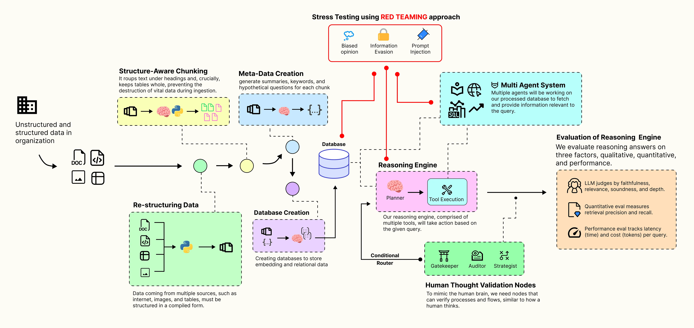

# AgenticRAG

[Building an Advanced Agentic RAG Pipeline that Mimics a Human Thought Process | by Fareed Khan | Level Up Coding](https://levelup.gitconnected.com/building-an-advanced-agentic-rag-pipeline-that-mimics-a-human-thought-process-687e1fd79f61)

标准RAG系统只查找、总结既有文件，并不会进行思考。Agentic RAG可以阅读、校正、链接、推理，使得其更像一个专家而不是检索工具。

本文试图构建一个Agentic RAG管线，模仿人类阅读以及理解问题的能力。

流程如下：

- 简历丰富的知识库。agent不止阅读文件，还会仔细分析文档，并且使用LLM添加总结和关键词，创建不同层次的理解。
- 整合专家队伍。每个专家不会精通所有事件，并且也不是agent本身。该队伍依赖专家工具：文档工具、数据库分析工具等。
- 门控网络。在执行前，门控网络会检查问题是否清晰和具体。如果不够清晰具体，会被要求重新分类。
- 规划师指定计划。一旦问题评估技术，规划者将请求分解为一步步的工具调用，保证进程架构清晰，避免回答冲突。
- 作者评估结果。每个工具的输入会被检查质量以及一致性。如果结果很弱或者存在矛盾，重新评估问题以及校正自身。
- 策略者将所有的细节串联起来，最终的回答不仅是事实的列表。策略者还会寻找相关性、模式、理论，将数据转化为更高深的视角分析。
- 对抗性测试。系统会被红队机器人挑战，提出棘手、误导或有偏见的问题，确保系统在压力下依然稳健可靠。
- 最终，它发展成超越简单问答的功能，新增了认知**记忆（从**过去互动中学习）、**守望台**（主动监控重要事件）和**神谕**（解读图表等视觉数据）等功能。

[FareedKhan-dev/agentic-rag: Agentic RAG to achieve human like reasoning](https://github.com/FareedKhan-dev/agentic-rag/?source=post_page-----687e1fd79f61---------------------------------------)

本质上是套了多层壳的agent