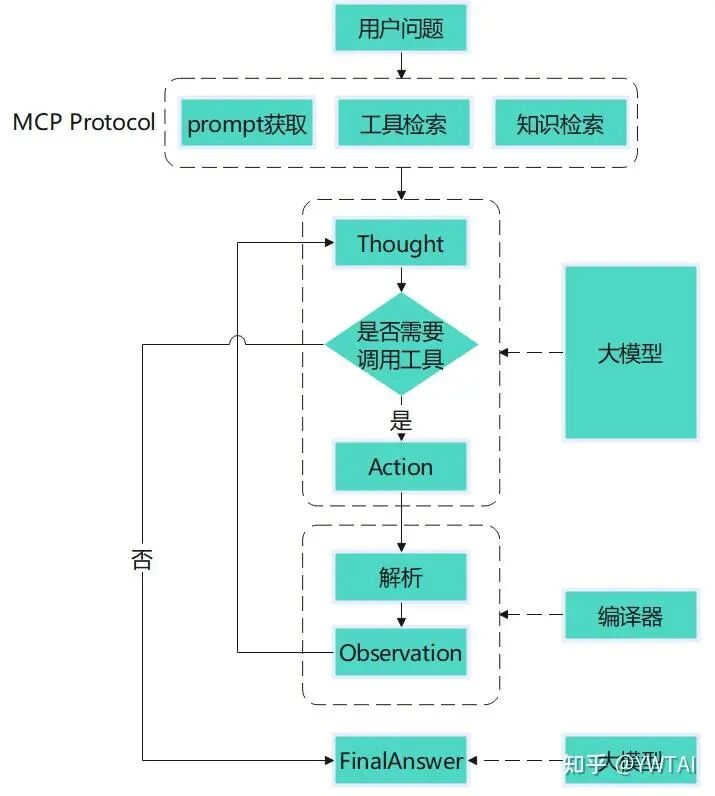
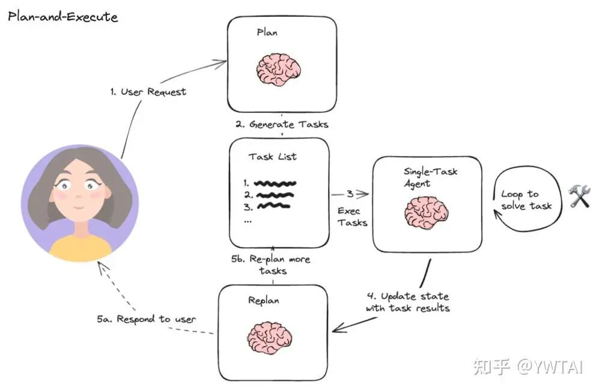
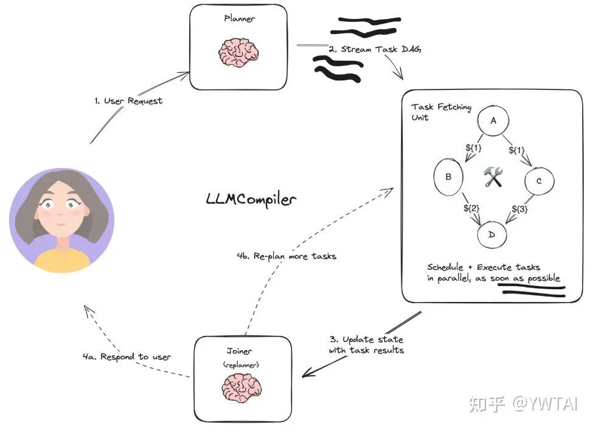
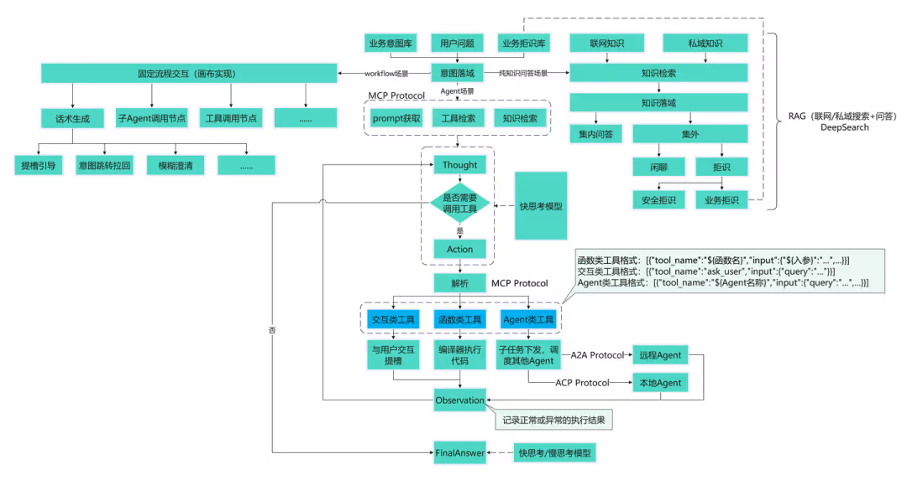
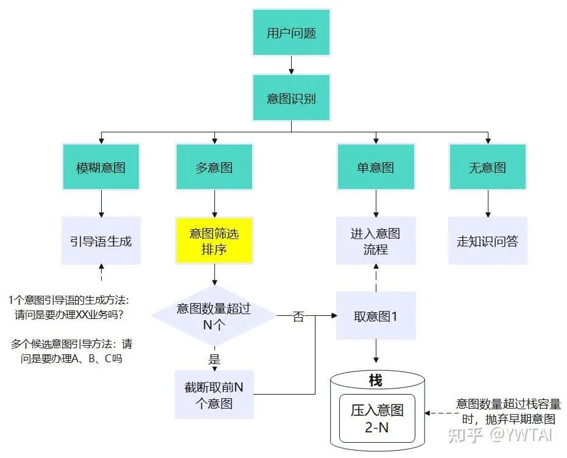

# ReAct决策框架

https://mp.weixin.qq.com/s/pfrFyjBf7vp1ahCNYe1xLA

**1）标准ReAct**

原理很简单，就是用户问题进来后，经过 Thought（思考）->Action（返回待执行工具列表）->Observation（工具执行结果）-> Thought（思考下一步要做什么）->...-> Answer（总结回复）这么一套链路。

新手需注意大模型不会直接执行工具，需要调用工具时只是返回 Action，里面记录工具名称和入参，由额外的编译器解析执行。



# Plan-and-Execute ReAct

标准 ReAct 更像是“深度搜索”，边规划边执行。而该方案类似“广度搜索”，先规划后执行，使用“1+N”多智能体协作的方式，先由“1”智能体给出执行计划，在协调“N”方向智能体按计划的步骤执行；

当计划执行完毕后，需要反馈给“1”判断是否需要给出新的执行计划，如果不需要则给用户总结回复。

“1”和“N”方向 Agent 的分工：“1”主要负责 plan、异常处理、总结；“N”负责具体的执行，包括工具调用、异常上报、问答。

基于该方案还有进一步的衍生方案，比如 LLMCompiler，规划时生成一个 DAG 图来执行 Action，可以理解成将多个工具聚合成一个工具执行图，用拓扑图的方式执行任务。

该方式可以并行执行多个无依赖关系的工具，减少大模型调用次数以提高响应效率。

现在市面上主流的 Agent 框架，如 langgraph、MetaGPT、AutoGen 和 CrewAI 等，不过是对这 2 种决策模型的工程化实现，不再一一介绍。

----

# 项目落地中的问题

## **ReAct 框架目前的局限性**

### 标准 ReAct

标准 ReAct 框架简单易用，**非常适用于业务逻辑不复杂**，单 Agent 少量工具的简单场景。但问题也比较明显：

**a.** 最终的回复放在 Action 的 Json 中，工程化时需要完整的把 Json 解析完才能给用户展示；如果最终回复比较长，且回复中可能还会包含其他业务需要大模型总结的结构化信息，会导致用户等待时间较长，感知不好。

**b.** 每次只能规划调用 1 个工具，当工具较多时会导致大模型调用次数增多，响应时间太长；但实际业务中有些工具之间没有依赖关系，可以并行调用。

**c.** 稳定性问题，尤其有特定需求需要对标准的 prompt 框架做改动调整时更明显，模型经常丢失如“Action:/Thought:”这样的前缀，或者最终回复的前面没有经过 Thought 直接输出。

### Plan-and-Execute ReAct

这个框架看起来很美好，先 Plan 再执行，也支持并行调用多个工具。

但实际使用中，**模型很难做完整正确的 Plan，**经常出现的是 Plan 的多个步骤之间有重复或存在缺失，即使每次执行完后会重新反思 Replan，但重新 Plan 的步骤可能还会出现和上次规划重复或输出与之前有矛盾的步骤，需要靠 prompt 工程和复杂的异常处理机制来兜底，且每次更换或更新模型，相同的 prompt 就不能很好的 work 了，调 prompt 就让人心力交瘁。

## 业务需求的复杂性

在讲述业务需求之前，需要先讨论个概念，即什么是 Agent？客户、产品和技术侧对这个概念的理解存在差异：

1）客户：是一套智能体应用，内部实现不一定是采用大模型任务规划。

客户关注的是**最终产品的展示形态**，如知识问答类 AI 客服和业务办理类 AI 客服，客户认为是 2 个 Agent，但内部可能就是 RAG/DeepSearch 问答或通过 workflow 画布流程配置实现。

2）产品：是一个智能体平台，支持 2 种配置模式：workflow 画布流程（静态任务规划）；另一种是 agentic 的方式（无画布流程的动态任务规划）

3）算法：我们理解的 Agent 主体是以纯大模型的动态任务规划为主，包括多智能体协同，以及如何与产品更好的结合。

结合刚刚讨论的内容，实际做项目过程中，客户的业务场景主体分为 3 大类：

**1）纯问答类：**针对客户提供的私域知识文档给用户直接回复。这类业务大多不涉及多轮交互，以一问一答为主；有的客户在部分场景允许接入联网知识，集外知识要区分拒识和闲聊等。

**2）workflow 类：**我们通常称之为“静态任务规划”，以查办类业务为主。

这类业务通常有标准的业务流程，如车险报案，需要逐步让客户提供信息（姓名、车辆信息、出险地点等，通过在画布中配置连续的提槽节点实现），最后形成报案工单，步骤明确。

模型只需关注意图识别、槽值抽取和话术生成（引导、跳转拉回等）3 类原子能力，其他的如整体的流程控制、工具调用等都可以通过画布拖拽节点实现。

出于业务性质和稳定性的考虑，实际项目交付过程中大多数业务流程都是通过在产品配置 workflow 实现。

**3）agent 类：**这里特指需要“动态任务规划”类的业务。适用于无固定交互流程且需要查询外部信息进行规划推理的场景（如理财产品推荐/设备故障排障，需要分析用户问题才知道需不需要调用工具进行任务编排，判断后续的执行动作应该是什么，无法通过画布配置固定流程实现）。

真实项目中大多以纯问答和 workflow 类实现的业务为主，尤其涉及到业务安全性和实时性高的场景，通过纯 agent 任务规划实现基本不可行（**尤其在金融领域，大模型监管备案异常严格，客户对新技术的需求也相对保守**）。

只有些比较开明，对前沿技术有追求的客户会分小部分安全性和实时性要求不高的场景允许我们做纯 agent 的尝试和研究，并集成到产品中，当用户问题通过意图分流到这些场景中时可以进行交互体验。

对于涉及到需使用 Agent 的场景，往往不单是调用接口工具那么简单。在 Agent 规划的过程中，还需要跟用户做多轮交互以确认工具查询不到的信息；然后某些规划步骤的执行可能需要调用另一个 Agent 才能完成。

举个做过的燃气公司的故障排障场景（简化说明），用户只说“燃气无法使用怎么办”，那么 Agent 需要先查询接口工具获取用户房产信息，通过房产信息查询系统中有没有停气、设备故障等信息；

如果系统接口查不到问题，则需要跟用户交互，通过提槽方式确认家中的设备可用状态，若用户表示均不可用，则按照报警器—>燃气表—>阀门—>燃气设备的顺序进行指引排障（具体每类的排障过程会对应 4 个子 Agent，因为内部也有比较复杂的流程），并基于用户的反馈调整排障策略。该场景就涉及到多智能体的协作。

综合来说，除了 Agent 技术本身，在项目落地过程中更需要设计一套完整的技术解决方案，在让客户能够感受到 Agent 赋能的同时解决客户实际相对全面的业务需求。

## 优化方案

针对上述问题，在做具体项目过程中，我结合项目需求做了很多技术和工程化相关的优化设计，大体内容如图所示：




内容有点多，关于纯问答相关的技术（如联网搜索问答、DeepSearch）暂不展开阐述（后面有时间更新），本次主体还是聚焦在 Agent 任务规划的优化说明。

注：因公司规定，优化后的完整 prompt 和我写的代码不便提供，但至少我可以把遇到的问题和优化思路分享给大家，希望对各位有所启发。

### ReAct 框架升级

主体还是基于标准 ReAct 的框架（“规划一步执行一步”的方式）进行升级，支持了 Multi-Agent 的模式。

没有采用先 Plan 后执行的方式，因为实测 Plan 的不稳定性很高，异常处理模块比较难兜底。

主要的优化点如下：

#### **快慢思考模型结合，“规划”和“总结回复”配置不同模型执行**

慢思考模型（思考+回复）出来之前，基本规划和总结回复都是通过 1 个快思考模型做。

但是实际使用发现最后的总结回复涉及到对工具调用结果的整理、分析和思考推理，快思考模型的效果并不好。

在慢思考模型出来后，我们尝试将这两部分拆开，规划用快思考模型（例如 deepseek V3），最后的回复总结用慢思考模型（如 deepseek R1），最终的回复效果会比只用 1 个模型好很多。

具体实现上，可以通过工程化解析快思考模型是否输出最终回复的前缀标签（可配，如“Finish:”等），如果解析到了就中断模型的输出，清除这轮模型的回复，转而调用慢思考模型去做回复总结。

#### **“泛化”工具的定义和使用方式**

目前研究者对工具的定义大多是作为函数接口或服务使用（服务本质上也可以理解为 1 个大“函数”，给输入返回输出）。

但前面提到在真实场景中，Agent 在做任务规划时，不光是需要通过函数接口工具获取信息，同时也需要与用户交互获取信息以决策下一步需要做的事情，或者将某个步骤的执行下发给其他 Agent，获取其他 Agent 的返回结果后再决策下一步需要做什么。

综上，我充分利用 Action 定义的 Json 结构，将工具定义为 3 种类型：

**（1）函数类工具：**传统的接口或服务，用于获取工具的执行结果（也可以获取问答知识）。

模型输出对应的接口名称和入参，编译器解析执行后返回运行结果。

大模型输出的格式：Action:[{"tool_name":"${接口名称}","input":{"${入参}":"...",...}}]。用列表的格式是允许 Action 一次可传入多个没有依赖关系的工具。

**（2）交互类工具：**当 Agent 规划当前需要从用户那里获取信息时返回，格式如下：Action:[{"tool_name":"ask_user","input":{"query":"..."}}]。

这里的 tool_name“ask_user”只需设置为 1 个固定字符串用于解析就行，不一定要用这个；入参就是需要咨询用户的问题，等待并获取用户响应后，将用户输入放入 Observation 中作为“ask_user”的“output”即可。

**（3）Agent 类工具：**当 Agent 判断某个信息需要其他 Agent 反馈时使用，格式如下：Action:[{"tool_name":"${Agent名称}","input":{"query":"...",...}}]。

这里的 tool_name 就是需要调用的 Agent 名称，input 中放入需要其他 Agent 解决的问题，同时也可以传入一些背景信息。最后将其他 Agent 最终的总结回复放入当前 Agent 本次的 Observation 中。

### **2. Multi-Agent 规划执行示例**

拿燃气故障排障场景给大家一个执行的例子（为便于展示对具体输出内容进行了删减，大家以理解格式和执行过程为主）：

```
注：“//”后的内容为我写的注释，不是模型生成的内容``Question:我家燃气无法使用了怎么办？``Thought:...根据业务流程说明，需要首先询问用户是否为工商户，如果不是工商户才进一步按排障流程执行...``Action:[{"tool_name": "ask_user", "input": {"query": "您好，请问您是否为工商户？"}}]``//等待用户输入``Observation:[{"tool_name": "ask_user", "output": {"user_response": "不是"}}]``Thought:...判断用户不是工商户，需要根据用户手机号查询用户的房产信息... //这里手机号是作为外部信息提前传入prompt中的``Action:[{"tool_name": "...", "input": {"user_phone_number": "..."}}]``//等待编译器执行``Observation:[{"tool_name": "...", "output": {"address":"...",...}}]``Thought:...根据房产信息中的...字段，查询燃气及设备故障信息...``Action:[{"tool_name": "...", "input": {...}}]``//等待编译器执行``Observation:[{"tool_name": "...", "output": {...}}]``Thought:...未查询到用户存在停气或设备故障信息，需要跟用户确认是否所有燃气设备都无法使用，若不是需指出具体哪个设备不可用...``//这块有个业务逻辑，就是用户家的表不一定是智能表，或即使是智能表，故障信息也不是实时更新，所以系统里没有查到异常不代表真的没有，只能跟用户交互去排障``Action:[{"tool_name": "ask_user", "input": {"query": "...请问您家中的燃气设备是否全部都无法使用？"}}]``//等待用户输入``Observation:[{"tool_name": "ask_user", "output": {"user_response": "是的"}}]``Thought:用户表示燃气设备全都无法使用，接下来需要依次进行报警器排障、燃气表排障、阀门排障、燃气设备排障。``Action:[{"tool_name": "x_agent", "input": {"query": "用户家中燃气设备全部无法使用，需排查报警器是否有故障"}}]``//---调度报警器排障Agent---``Thought:...``Action:...``Observation:...``Thought:...``Finish:经过排查，用户的报警器无异常...``//---调度结束，返回主Agent``Observation:[{"tool_name": "x_agent", "output": {"agent_response": "经过排查，用户的报警器无异常..."}}]``Thought:接下来需要进行燃气表排障...``Action:[{"tool_name": "y_agent", "input": {"query": "用户家中燃气设备全部无法使用，需排查燃气表是否有故障"}}]``//---调度燃气表排障Agent---``Thought:...``Action:...``Observation:...``Thought:...``Finish:经过排查，用户的燃气表存在...异常，需要告知用户执行...操作，并询问用户燃气表是否恢复正常``//---调度结束，返回主Agent``Observation:[{"tool_name": "y_agent", "output": {"agent_response": "经过排查，用户的燃气表存在...异常，需要告知用户执行...操作，并询问用户燃气表是否恢复正常"}}]``Thought:当前发现燃气表出现...异常，需要告知用户执行...操作，并询问用户燃气表是否恢复正常``Action:[{"tool_name": "ask_user", "input": {"query": "当前发现燃气表出现...异常，请您按执行...操作，看燃气表是否恢复正常了呢？"}}]``...``//依次完成对报警器排障、燃气表排障、阀门排障、燃气设备的排障后，需询问用户的问题是否已解决``Thought:当前已完成对报警器排障、燃气表排障、阀门排障、燃气设备的排障，用户反馈所有燃气设备已恢复正常，需询问用户的问题是否已解决``Action:[{"tool_name": "ask_user", "input": {"query": "当前燃气设备均已恢复正常，请问您的问题是否已解决呢？"}}]``//等待用户输入``Observation:[{"tool_name": "ask_user", "output": {"user_response": "是的，燃气可以用了，感谢"}}]``Thought:所有任务已执行完毕，用户反馈问题已解决...``//最终回复中需要总结当前排查过程中出现了哪些问题，以及如何解决的；这个信息主要是燃气公司要将本次排查过程记录成工单所需，<final_json>...</final_json>中的内容可以不给用户展示``Finish:好的，有其他问题欢迎咨询！<final_json>{"summary": "经过排查..."}</final_json>
```

### 异常处理

不好讲的太细，大体说一些常见的：

**1）**利用 Constrained Decoding 的技术（主流的处理方案有基于 FSM（有限状态机）或 CFG（上下文无关文法）的解码方案）解决大模型无法稳定输出 JSON 格式的问题。

**2）**模型有时会出现“臆想”工具执行结果的情况：当模型输出“Observation...”时，需要工程化截断并删掉包含“Observation...”及其后的内容。

**3）**正则过滤经常出现的错误模式：比如结构化数据前后多余的换行空格。

**4）**对于函数类工具，若模型生成的工具名称或入参出现错误导致解析器调用失败，需工程化捕获异常，重新请求大模型生成 Action；

如果超过一定次数均失败，这时的兜底处理就取决于产品经理和客户的想法了，这块要以客户能接受的方式为主（像燃气这边的客户打趣说直接像 deepseek 刚发布时一样告诉用户“系统繁忙请稍后重试”也是可以的，总之不能告诉用户是模型错了哈哈）。

**5）**对于交互类工具，如果格式解析有异常，因为就是跟用户交互，只要能根据关键词（比如示例中的“ask_user”）判断出是这类工具，直接代码重新拼接，清空历史保存的错误 Action。

**6）**对于 Agent 类工具，如果子 Agent 执行中出现异常，捕获后也是需要尝试重新调用，处理方式与 4）类似。

**7）**需要做重复规划或循环规划的检测：分析最新规划的 Action 结果是否在历史记录中出现过，若存在重复规划需要在下次调用大模型时输入冲突提示并重新请求规划，如果“无效”规划超过一定次数也是要有兜底策略，如参考 4）的处理策略或其他方式，需要与产品经理和客户沟通。

### 其他技术点探讨

前面提到，真实场景中，往往 Workflow（固定流程的查办类业务）、纯 Agent（无固定流程的复杂业务）和纯问答（咨询）场景都会有，那会产生以下几个问题：

1）“多意图”问题

用户问题进来首先会进行意图识别，若用户一句话同时包含多个意图（如 Workflow、Agent 和问答类场景的排列组合），应该怎么处理？或者用户表述不清，应该怎么做？

