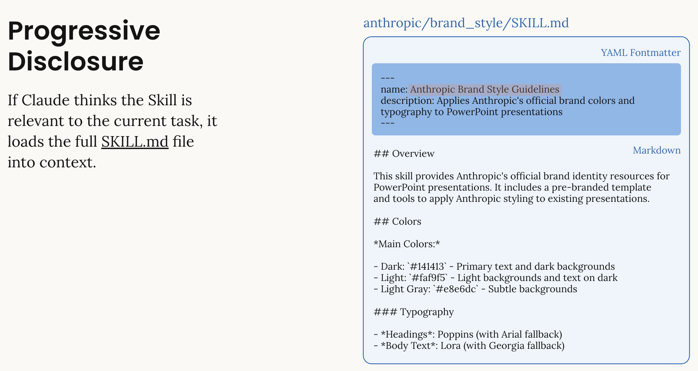
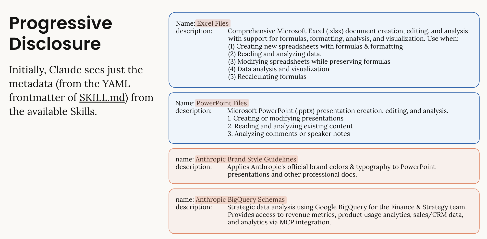

# Skills

由Cluade提出的另一种非MCP方式的Agent方式。现如今的Agents像数学天才，在有上下文情况下有着卓越的推理能力，但是当缺少重要上下文的时候，他们不能理解你的专业领域，而且不能自动从重复的工作中学习。

> Skills填补了这个空缺，它可以以特定形式打包主要的专业知识，让agents可以持续的改进并应用到新的工作中。

```bash
anthropic_brand/
├── SKILL.md
├── docs.md
├── slide-decks.md
└── apply_template.py
```

## Skill.md格式

1. **元数据** (name: 64 chars, description: 1024 chars): Claude sees skill name and description
2. **指令全文** (<5k tokens): Loaded when skill is relevant
3. **链接文件**: Additional resources loaded only if needed



Claude至看到YAML文件中的前缀信息，只有当该skill完全匹配的时候，Claude才会载入全部的目录信息。



---

## 和schema的区别

简单来说：**Schema 定义了 AI “能做什么”（接口），而 Skills 教会了 AI “该如何做”（专业知识、流程和最佳实践）**。

下面这个表格能清晰地展示这种维度上的差异。

| 对比维度           | 方案A: 预写 Schema (传统工具调用)                         | 方案B: Claude Skills (技能)                                  | 核心差异           |
| ------------------ | --------------------------------------------------------- | ------------------------------------------------------------ | ------------------ |
| **本质**           | **工具说明书**：定义函数的输入输出                        | **专家知识包**：包含工作流程、检查清单、脚本和领域经验       | **工具 vs 专家**   |
| **工作原理**       | AI 看到接口，但需要自己摸索如何使用、何时使用以及如何组合 | AI 被授予一套完整的“作业指导书”，知道标准流程和最佳实践      | **摸索 vs 指导**   |
| **内容形式**       | 静态的 JSON Schema（参数定义）                            | 动态的、包含多层信息的文件包（指令、脚本、参考资料）         | **单一 vs 丰富**   |
| **工作流程**       | ❌ 不包含。AI 需自行规划步骤，容易出错或偏离               | ✅ **内置**。明确指导 AI 先验证、再填充、最后检查的标准化流程 | **试错 vs 标准化** |
| **Token 效率**     | 较低。所有工具定义需一次性全量加载到上下文                | 极高。采用**渐进式披露**，按需加载知识，大幅节省 Token       | **浪费 vs 高效**   |
| **复杂任务成功率** | 较低（约60-70%），依赖 AI 的临场发挥和试错                | 较高（约90-95%），有专家知识保驾护航                         |                    |