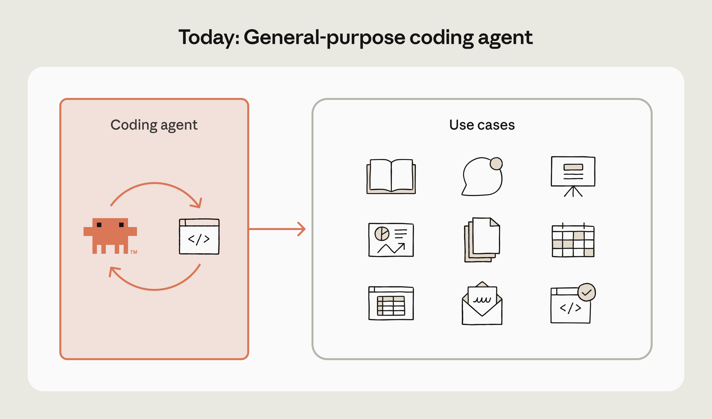

# How enterprises are building AI agents in 2026

【2025.11.09】https://claude.com/blog/how-enterprises-are-building-ai-agents-in-2026

## 数据

数据显示agent主要应用领域为coding。报告显示，人工智能在整个开发生命周期中都节省了时间：规划和构思（58%）、代码生成（59%）、文档编写（59%）以及代码审查和测试（59%）。但其影响远不止于工程领域。数据分析和报告生成（60%）以及内部流程自动化（48%）也位列最具影响力的应用案例之列。展望未来，56% 的企业计划在未来一年内部署智能体用于**研究和报告**。

## 实践

[汤森路透](https://www.claude.com/customers/thomson-reuters)利用 Claude 为其人工智能法律平台 CoCounsel 提供技术支持。律师们过去需要花费数小时手动搜索文件，现在只需几分钟即可访问 150 年的案例法和 3000 位领域专家的信息。

网络安全公司[eSentire](https://www.claude.com/customers/esentire)将专家威胁分析的时间从 5 小时缩短至 7 分钟，其人工智能驱动的分析结果与高级安全专家的判断有 95% 的吻合度。在医疗保健领域，[Doctolib](https://claude.com/customers/doctolib)在其整个工程团队中部署了 Claude Code，仅用数小时就取代了原有的测试基础设施，而传统测试基础设施则需要数周时间才能完成，并且新功能的发布速度提高了 40%。

零售业也取得了类似的增长。[欧莱雅](https://claude.com/customers/loreal)在对话式分析方面实现了99.9%的准确率，使每月4.4万用户能够直接查询数据，而无需等待定制的仪表盘。

## 前瞻

[2026 State of AI Agents Report.pdf](./Paper/2026 State of AI Agents Report.pdf)


# 为代理装备技能应对特殊工作

https://claude.com/blog/building-agents-with-skills-equipping-agents-for-specialized-work

## 新范式：code is all you need

过去我们认为不同领域的智能体应该各不相同。比如code、research等智能体都需要专属工具和框架。业界最初也接受了相关智能体模式。但随着模型智能水平提升和智能体能力进步，我们逐步转向另一种方法。


我们逐渐意识到，代码不仅仅是一种用例，而是智能体执行所有数字工作的接口。Claude Code是一个编码智能体，也是一个通用智能体，它恰好通过代码来工作。



可以考虑使用Claude Code生成财务报告。可以调用API进行研究，将数据储存在文件系统中，使用Python分析，并提炼出有价值的见解，这些都可以通过代码完成。搭建框架非常简单，只需要bash脚本和文件系统即可。

但一般能力不同同于专业技能。当使用Claude Code应用于实际工作时，差距开始显现。

## 缺失的一环：领域专业知识

你会选择谁来帮你报税：一个数学天才从零开始推算，还是一个经验丰富的税务专家，他已经处理过成千上万份报税单？大多数人会选择税务专家。这并非因为他们更聪明，而是因为他们拥有相关的专业知识。

如今的员工就像数学天才：他们善于推理解决新问题，但往往缺乏经验丰富的专业人士所积累的专业知识。在适当的指导下，他们能做出令人惊叹的事情。然而，他们常常忽略重要的背景信息，难以吸收组织的专业知识，也无法从重复性任务中自动学习。

Skills通过将领域专业知识打包成代理商可以逐步访问和应用的形式来弥合这一差距。

## 什么是Skills

技能包包含代理人的领域专业知识和程序知识。

```yaml
anthropic_brand/
├── SKILL.md
├── docs.md
├── slide-decks.md
└── apply_template.py
```

技能的简洁性是刻意设计的。文件是一种通用的基本单位，可以与你现有的资源兼容。你可以使用 Git 进行版本控制，将它们存储在 Google 云端硬盘中，并与团队共享。这种简洁性也意味着技能创建不再局限于工程师。产品经理、分析师和领域专家也已经在构建技能，以规范他们的工作流程。

## **渐进式披露**

技能可以包含大量信息。为了保护上下文窗口并使技能可组合，它们采用渐进式披露：在运行时，仅向模型显示元数据（来自 YAML 前置元数据的名称和描述）。

```yaml
---
name: Anthropic Brand Style Guidelines
description: Anthropic's official brand colors and typograph
---
```

如果 Claude 判断需要某项技能，它会读取完整的 SKILL.md 文件。为了提供更多详细信息，技能可以包含一个 references/ 目录，其中的辅助文档仅在需要时加载。

这种三层方法意味着您可以为代理配备数百种技能，而不会使其上下文窗口过载——元数据使用约 50 个标记，完整的 SKILL.md 文件使用约 500 个标记，参考文件使用 2,000 多个标记，并且仅在需要时才使用。

## **技能可以包括使用脚本作为工具**

传统工具存在一些问题：有些工具的说明文档编写不完善，模型并非总能对其进行修改或扩展，而且它们常常会占用大量的上下文窗口空间。而代码则不同，它具有自文档性，可修改，并且无需始终处于上下文中。

举个真实的例子：我们发现克劳德一直在编写同一个脚本，将 Anthropico 样式应用到幻灯片上。所以我们请克劳德把它保存为一个工具供自己使用：

```python
# anthropic/brand_styling/apply_template.py
import sys
from pptx import Presentation

if len(sys.argv) != 2:
    print("USAGE: apply_template.py <pptx>")
    sys.exit(1)

prs = Presentation(sys.argv[1])
for slide in prs.slides:
    ...
```

slide-decks.md 中的相应文档只是简单地引用了以下脚本：

```python
## Anthropic Slide Decks
- Intro/outro slides
  - background color: `#141413`
  - foreground color: oat
- Section slides:
  - background color: `#da7857`
  - foreground color: `#141413`

Use the `./apply_template.py` script to update a pptx file in-place.
```

## **技能生态系统**

技能生态系统迅速发展，目前我们已经看到三种主要类型的技能正在构建：

### **基础技能**

[这些技能涵盖了每个人都需要的核心功能：处理文档、电子表格、演示文稿等等。它们总结了文档生成和处理的最佳实践。您可以通过探索我们公共知识库中的基础技能，](https://github.com/anthropics/skills/tree/main/skills/public)了解这些技能在实践中的应用。

### **合作伙伴技能**

随着技能规范化代理与专业功能交互的方式，各公司正在构建技能，使其服务能够被代理访问。K [-Dense](https://github.com/K-Dense-AI/claude-scientific-skills)、[Browserbase](https://github.com/browserbase/agent-browse)、[Notion](https://www.notion.so/notiondevs/Notion-Skills-for-Claude-28da4445d27180c7af1df7d8615723d0)等[众多公司](https://claude.com/blog/organization-skills-and-directory)正在创建能够直接集成其服务的技能，在保持技能格式简洁性的同时，扩展 Claude 在特定领域的功能。

### **企业技能**

组织会构建专有技能，以编码其内部流程和领域专业知识。这些技能有助于捕捉特定的工作流程、合规性要求和机构知识，从而使代理人能够胜任企业工作。

## **我们观察到的趋势**

随着技能应用的普及，一些趋势正在显现，预示着这一范式未来的发展方向。这些趋势影响着我们对技能设计的思考方式，以及我们为支持技能开发者而构建的工具。

### **日益复杂**

早期的技能仅限于简单的文档查阅。现在我们看到的是复杂的多步骤工作流程，它能够协调跨多个工具的数据检索、复杂计算和格式化输出。

- **简单版**：“状态报告编写器”（约100行）- 模板和格式
- **中级**：财务模型构建器（约 800 行）- 数据检索，使用 Python 进行 Excel 建模
- **复杂流程**：“RNA测序流程”（2500多行代码）- 协调HISAT2、StringTie和DESeq2分析

### **技能和 MCP**

[技能和 MCP 服务器可以自然地协同工作](https://claude.com/blog/extending-claude-capabilities-with-skills-mcp-servers)。例如，一项竞争分析技能可以协调网络搜索、通过 MCP 获取的内部数据库、Slack 消息历史记录以及 Notion 页面，从而综合生成一份全面的报告。

### **非开发者采用**

技能创建正从工程师扩展到产品经理、分析师和各领域的专家。他们可以使用技能创建工具，在 30 分钟内创建并测试自己的第一个技能。该工具会以交互式的方式引导他们完成整个过程。我们正在努力让技能创建更加便捷，通过改进工具和模板，让任何人都能轻松获取和分享专业知识。

## **完整的架构**

综合来看，新兴的代理架构看起来像是以下几方面的组合：

1. **智能体循环**：决定下一步行动的核心推理系统
2. **代理运行时**：执行环境（代码、文件系统）
3. **MCP 服务器**：连接到外部工具和数据源
4. **技能库**：领域专业知识和程序知识

每一层都有明确的用途：循环层负责推理，运行时负责执行，MCP负责连接，技能层负责指导。这种分离使得系统易于理解，并允许每个部分独立演进。

想象一下，如果在这个架构中添加一项技能会发生什么。[前端设计技能](https://github.com/anthropics/claude-code/tree/main/plugins/frontend-design)可以立即提升 Claude 的前端能力。它提供关于排版、色彩理论和动画的专业指导，并且仅在构建 Web 界面时激活。渐进式披露意味着它仅在需要时加载。添加新功能也非常简单。

## **将技能部署到新的垂直领域**

这种配备 MCP 服务器和技能的通用代理的新兴模式已经帮助我们将 Claude 部署到新的垂直领域。

### **金融服务**

在推出技能功能后不久，我们[针对金融服务](https://www.anthropic.com/news/claude-for-financial-services)行业增强了 Claude 的功能，使其对金融专业人士更有用：

- **DCF模型构建器**：构建包含正确WACC计算和敏感性分析的折现现金流模型
- **可比公司分析**：生成包含相关倍数和基准的可比公司表格
- **盈利分析**：处理季度业绩并编制投资更新报告
- **初步研究报告**：利用财务模型构建全面的研究报告
- **尽职调查**：运用标准化框架构建并购分析框架
- **提案材料**：根据行业标准制作客户演示文稿

### **医疗保健与生命科学**

我们还增强了[医疗保健和生命科学领域](https://www.anthropic.com/news/healthcare-life-sciences)的服务，使 Claude 对研究人员、临床医生和医疗保健开发人员更有用：

- **生物信息学工具包**：scVI 工具和 Nextflow 部署所需的技能，对于管理基因组流程和单细胞 RNA 测序至关重要
- **临床试验方案生成**：加速临床研究方案的制定
- **科学问题选择**：帮助研究人员识别和构建有影响力的研究问题
- **FHIR 开发**：帮助开发人员编写更准确的健康数据互操作性代码，以更少的错误更快地连接医疗保健系统。
- **事先授权审核**：通过交叉比对保险范围要求、临床指南和患者记录，减轻行政负担，加快患者获得所需医疗服务的速度。

## **标准化代理技能**

为了实现这一愿景，我们将[Agent Skills](https://agentskills.io/)作为开放标准发布。与 MCP 类似，我们认为技能应该能够在不同的工具和平台之间移植。无论您使用的是 Claude 还是其他 AI 平台，相同的技能都应该能够正常工作。我们一直在与生态系统成员合作制定该标准，并期待看到它得到早期应用。

当用户首次使用人工智能代理时，它应该已经了解您和您的团队关注的重点，因为技能能够捕捉并传递这些专业知识。随着生态系统的发展，社区中其他成员开发的技能可以使您的代理更加实用、可靠和强大——无论他们使用的是哪个人工智能平台。

## **入门**

我们正在构建通用代理的架构，而技能则为交付和共享新功能提供了一种范式。真正的价值源于我们共同构建的集体知识库：收集专业知识，在团队间传递这些知识，并使每个代理都比上一个代理更强大。

**资源：**

- [不要培养代理人，而是培养技能](https://youtu.be/CEvIs9y1uog?si=yhYQH-ZTX0DfNdtm)（YouTube 视频）
- [技能文档](https://platform.claude.com/docs/en/agents-and-tools/agent-skills/overview)
- [GitHub 仓库](https://github.com/anthropics/skills)
- [技能食谱](https://platform.claude.com/cookbook/skills-notebooks-01-skills-introduction)
- [克劳德运用技能](https://support.claude.com/en/articles/12512180-using-skills-in-claude)
- [技能 API 快速入门](https://platform.claude.com/docs/en/build-with-claude/skills-guide)
- [技能最佳实践文档](https://platform.claude.com/docs/en/agents-and-tools/agent-skills/best-practices)
