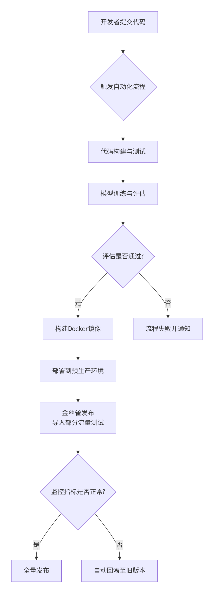

# 项目架构理解

本文主要针对在面对github陌生项目时，无法清楚的知道具体文件的作用这一情况，而产出的内容。

计算机软件项目作为严谨的工程项目，应该具有相应的规章制度，即使不是明文规定，也应当是约定俗成的。基于此推断，借助大模型工具，对项目架构进行了相应的梳理。

## 根目录关键文件

```bash
# 查看根目录关键文件
README.md          # 项目简介、快速开始
CONTRIBUTING.md    # 贡献指南
docs/              # 文档目录
package.json       # 前端项目配置
requirements.txt   # Python依赖
pom.xml            # Java Maven配置
.gitlab-ci.yml     # CI/CD配置
Dockerfile         # 容器化配置
docker-compose.yml # 多容器编排
```

## 目录结构

```bash
├── src/           # 源代码
│   ├── main/      # 主代码（Java等）
│   ├── test/      # 测试代码
│   ├── api/       # API接口
│   ├── models/    # 数据模型
│   ├── services/  # 业务逻辑
│   ├── utils/     # 工具类
│   └── config/    # 配置
├── public/        # 静态资源
├── tests/         # 测试目录
├── scripts/       # 部署脚本
├── docs/          # 文档
├── .github/       # GitHub工作流
└── config/        # 配置文件
```

## CI/CD管道：实现自动化和可重复性

**Continuous Integration/Continuous Delivery持续集成和持续交付**

CI/CD管道自动化了从代码提交到服务上线的全过程，特别强调版本控制和渐进式发布



**版本控制一切**：使用 **Git** 管理代码和配置文件，使用 **DVC** 管理大容量的模型文件和数据，确保每一步都可追溯。

**自动化评估**：模型的评估远复杂于传统软件，需要通过自动化脚本评估其准确性、毒性、逻辑性等多维度指标，只有达标后才会自动进入下一阶段。

**安全部署与监控**：采用**金丝雀发布**等策略，先将新模型服务部署给少量用户，同时进行实时监控。一旦发现异常（如延迟飙升），系统会自动回滚到旧版本，保障线上服务的稳定性。

> 金丝雀发布（Canary Release）是一种逐步将新版本软件发布给用户的技术。开始时，只将新版本部署到一小部分用户（比如1%），然后逐步增加百分比，同时监控关键指标（如错误率、延迟等）。如果出现问题，可以立即回滚，从而最小化影响。